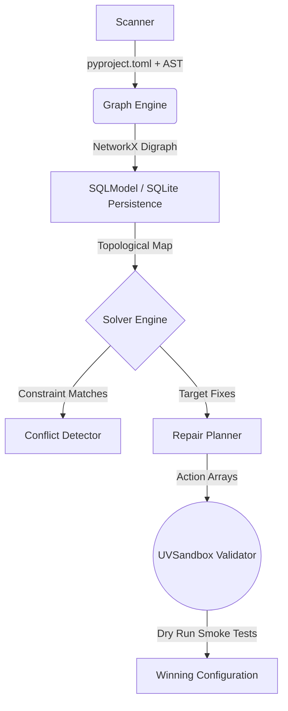

<div align="center">
  
  
  <h1 align="center">Converge</h1>
  
  <p align="center">
    <strong>The Python-First Repository Intelligence & Environment Convergence Platform</strong>
  </p>

  <p align="center">
    <a href="https://pypi.org/project/converge-cli/"></a>
    <a href="https://python.org"></a>
    <a href="https://github.com/astral-sh/uv"></a>
    <a href="https://opensource.org/licenses/MIT"></a>
  </p>

  <p align="center">
    <em>Converge mathematically proves your dependency topologies to automatically construct, validate, and repair broken Python environments.</em>
  </p>
</div>

<br />

---

## Executive Summary

**Dependency hell is a solved problem.** 

Converge is a deterministic intelligence engine built for modern Python monorepos. Rather than relying on brute-force lockfile regeneration or isolated heuristics, Converge treats your entire codebase—from declared dependencies down to Abstract Syntax Tree (AST) imports—as a unified Directed Acyclic Graph (DAG). 

When conflicts arise, Converge's **Solver Engine** instantly synthesizes hundreds of potential remediation paths, isolating and testing the most statistically viable solutions in sub-second `uv` virtual environments, guaranteeing verifiable correctness before a single file is ever permanently touched.

---

## 🌟 Key Capabilities

| Feature | Description |
| :--- | :--- |
| **AST-Level Import Tracing** | Bypasses standard `requirements.txt` checks to statically analyze every function, module, and `import` signature across your AST. |
| **Deterministic Conflict Detection** | Identifies `VERSION_CLASH` and latent `UNRESOLVED_IMPORT` anomalies mathematically prior to runtime execution. |
| **Autonomous Resolution** | Engine generates `RepairPlan` vectors, computing minimal-drift downgrades or implicit package injections. |
| **Agentic By Design** | Seamless SDK and standard CLI hooks specifically engineered for orchestration by large language models and autonomous developer agents. |
| **Sub-Second Validation** | Implements the **UVSandbox Guard**, leveraging the unparalleled execution speed of Astral `uv` for dynamic `subprocess` verification. |

---

## 🛠 Architecture

Converge separates state inference from isolated execution:



---

## ⚡ Installation

We strongly recommend installing Converge into an isolated global environment via `uv tool`:

```bash
uv tool install converge-cli
```

*For legacy systems without `uv`:*
```bash
pipx install converge-cli
```

---

## 📖 Usage Guide

Converge exposes a robust Typer-based CLI wrapped in high-fidelity `rich` terminal output.

### 1. Initialize & Scan
Build a topological analysis of the target repository. This populates a highly indexable SQLite graph.

```bash
converge scan /path/to/project
```

### 2. Visualize the Topology
Trace dependency requirements, exposing edge depths and transitive constraints.

```bash
converge deps repo:my_target_project
```

### 3. Engine Diagnosis & Validation
Run the solver engine against the currently constructed graph to mathematically detect latent conflicts.

```bash
converge doctor
```

### 4. Autonomous Repair
Instruct Converge to simulate and isolate fixes. By default, this runs as a purely mathematical *dry-run*.

```bash
converge fix /path/to/project
```

Once the optimal repair vector is identified by the `UVSandbox`, inject it into your primary operating environment:

```bash
converge fix /path/to/project --apply
```

---

## 🤝 System Requirements

- Execution Environment: MacOS / Linux
- Python Runtime: `python >= 3.12`
- Core Dependencies: `uv`, `networkx`, `sqlmodel`, `typer`, `pydantic`

---

## 🌐 Agent Developer Kit
Converge serves as the definitive architecture for embedded agent operations. For complete integration mechanics, solver overrides, and raw SDK endpoints, please consult the agent directive at [`.github/skills/converge-architecture.md`](./.github/skills/converge-architecture.md).

<div align="center">
  <br />
  <p>Engineered for highly reliable software supply chains.</p>
</div>
