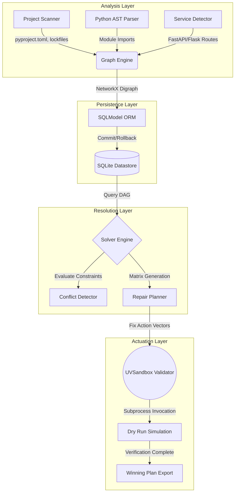

<div align="center">
  
  
  <h1 align="center">Converge</h1>
  
  <p align="center">
    <strong>The Python-First Repository Intelligence and Environment Convergence Platform</strong>
  </p>

  <p align="center">
    <a href="https://pypi.org/project/converge-cli/"></a>
    <a href="https://python.org"></a>
    <a href="https://github.com/astral-sh/uv"></a>
    <a href="https://opensource.org/licenses/MIT"></a>
  </p>

  <p align="center">
    <em>Converge mathematically proves your dependency topologies to automatically construct, validate, and repair broken Python environments.</em>
  </p>
</div>

<br />

---

## 1. Executive Summary

Dependency management in Python has historically been fraught with complexity, characterized by conflicting package versions, transient dependency resolution failures, and environments that slowly degrade over time. Converge is architected from the ground up to solve this problem deterministically.

Converge operates on a simple but powerful principle: a software project and its environment can be modeled as a Directed Acyclic Graph (DAG) of packages, modules, syntax trees, and infrastructure dependencies. By performing rigorous static analysis on your Python Abstract Syntax Trees (AST) and cross-referencing this against declared package boundaries, Converge identifies latent anomalies before they manifest at runtime.

Through its integration with the Astral `uv` toolchain, Converge is capable of not only detecting these anomalies but proposing optimized mathematical vectors to resolve them. It can then securely execute these repair strategies in sub-second isolated execution contexts to prove their validity.

---

## 2. Table of Contents

1. [Executive Summary](#1-executive-summary)
2. [Table of Contents](#2-table-of-contents)
3. [Key Capabilities](#3-key-capabilities)
4. [System Architecture](#4-system-architecture)
5. [Installation Guide](#5-installation-guide)
6. [Quick Start Tutorial](#6-quick-start-tutorial)
7. [Mathematical Foundation of the Solver Engine](#7-mathematical-foundation-of-the-solver-engine)
8. [Abstract Syntax Tree (AST) Parsing Analytics](#8-abstract-syntax-tree-ast-parsing-analytics)
9. [Graph Visualization and Query Operations](#9-graph-visualization-and-query-operations)
10. [Sandboxed Environment Validation via UV](#10-sandboxed-environment-validation-via-uv)
11. [Extensive API Reference](#11-extensive-api-reference)
12. [Command Line Interface (CLI) Manual](#12-command-line-interface-cli-manual)
13. [Configuration Options](#13-configuration-options)
14. [Continuous Integration (CI) Deployment Patterns](#14-continuous-integration-ci-deployment-patterns)
15. [Extending Converge: Plugin Development](#15-extending-converge-plugin-development)
16. [Security Posture and Threat Modeling](#16-security-posture-and-threat-modeling)
17. [Contributing Guidelines](#17-contributing-guidelines)
18. [Troubleshooting and Diagnostic Protocols](#18-troubleshooting-and-diagnostic-protocols)
19. [Changelog and Release History](#19-changelog-and-release-history)
20. [License Information](#20-license-information)

---

## 3. Key Capabilities

### AST-Level Topological Mapping
Converge does not merely rely on `requirements.txt` or `pyproject.toml` declarative metadata. It recursively traverses your project directory, compiling modules into their respective syntax trees. It traces every `import` signature, enabling Converge to identify precisely which external constraints your application asserts on the environment layer.

### Deterministic Anomaly Detection
The analysis layer cross-references structural import expectations against project specifications and ecosystem packaging manifests to detect `VERSION_CLASH`, `UNRESOLVED_IMPORT`, and `MISSING_DEPENDENCY` conditions. This proactive detection catches environment defects long before deployment.

### Automated Repair Vector Synthesis
Once a conflict is triangulated, Converge computes multiple non-destructive repair vectors. Whether it requires downgrading conflicting dependencies, explicitly pinning versions, or injecting undeclared transitive imports, the Planner algorithm defines precise environment transformations.

### Impermeable Sub-Second Validation Contexts
Theoretical fixes are meaningless if they cause secondary runtime regressions. Converge drops down into OS-native execution layers, wrapping `.venv` virtualized sandboxes via `uv`. It clones your environment, applies the theoretical fix, executes rigorous module smoke-tests, and verifies the success tensor in mere milliseconds.

### Autonomous Agent Integration
Modern software systems require self-healing mechanisms. Converge exposes an explicit Agent Developer Kit (ADK) that allows autonomous constructs, internal platform engineering teams, or CI workflows to orchestrate dependency resolution programmatically. The API bindings mirror the CLI surface area exactly.

---

## 4. System Architecture

The internal architecture of Converge is cleanly stratified across four primary boundaries. This segmentation ensures zero internal leakage between static analysis and runtime evaluation.



### Component Deep Dive

1. **Analysis Layer (Scanner)**: Resides in `src/converge/scanner/`. Implements visitor patterns extending `ast.NodeVisitor` to heuristically interpret source code. 
2. **Persistence Layer (Store)**: Resides in `src/converge/graph/`. Translates standard Pydantic models into SQLAlchemy scalar relationships utilizing `SQLModel`. The data is persisted locally to `converge_graph.db` to prevent repetitive analysis penalty across frequent invocations.
3. **Resolution Layer (Solver)**: Resides in `src/converge/solver/`. Reconstructs the database records into a stateful `nx.DiGraph`. Evaluates cyclic paths and bipartite constraints.
4. **Actuation Layer (Validation)**: Resides in `src/converge/validation/`. Employs Python's `subprocess` to directly invoke system `uv` binaries. It constructs arbitrary `.venv` folders, injects configurations, monitors for OS signals or crashes, and returns clean deterministic outputs.

---

## 5. Installation Guide

Converge is distributed through the Python Package Index (PyPI). However, because Converge is a command-line application that manages environments, installing it directly into your global Python environment or a project-specific virtual environment via `pip` is considered an anti-pattern. Doing so risks creating circular dependencies between Converge and the project it is attempting to evaluate.

The recommended installation vector utilizes `uv tool` or `pipx`.

### Global Installation via UV (Recommended)

`uv tool install` creates an isolated global environment specifically for the CLI command, ensuring that Converge's internal dependencies (like `pydantic`, `typer`, and `networkx`) never conflict with your active development requirements.

```bash
uv tool install converge-cli
```

### Upgrading UV Installations

When a new version of Converge is released, upgrade the installation seamlessly:

```bash
uv tool upgrade converge-cli
```

### Alternative Installation via Pipx

If you do not have `uv` installed centrally (though Converge requires `uv` to be present on your system for sandbox execution), you may use `pipx`.

```bash
pipx install converge-cli
```

### Source Code Installation for Core Development

If you intend to modify the parsing logic, extend the graph database schemas, or implement new traversal algorithms, you must install Converge from source.

1. Clone the master repository via Git.
2. Ensure you have Python 3.12 or greater.
3. Utilize `uv` to bootstrap the development sandbox.

```bash
git clone https://github.com/desenyon/converge.git
cd converge
uv venv
source .venv/bin/activate
uv pip install -e ".[dev]"
```

Verify the installation by querying the command interface version matrix:

```bash
converge --help
```

---

## 6. Quick Start Tutorial

This section provides a sequential walkthrough of standard Converge operations, demonstrating how a platform engineer or automated orchestration script might utilize the CLI.

### Step A: Initializing the Project Index

Before Converge can evaluate dependency drift, it must construct the foundational DAG. Navigate to the root directory of your Python project and invoke the scanning protocol.

```bash
cd /workspace/my_large_monorepo
converge scan .
```

During this operation, Converge parses every Python file within the directory structure (respecting `.gitignore` exclusions), extracting all `import` segments and declarative metadata found in `pyproject.toml` or `requirements.txt`. The resultant data structure is persisted natively to `./converge_graph.db`. This database serves as the source of truth for subsequent commands.

### Step B: Investigating Topological Dependencies

You can manually intercept the database contents traversing the localized graph. This is incredibly useful for untangling legacy modules.

```bash
converge deps mod:src/main.py
```

The output is processed through a rich terminal UI, outputting color-coded, hierarchical trees demonstrating exactly which internal packages, external third-party libraries, and arbitrary route definitions your specified entity relies upon.

### Step C: Running the Diagnostic Engine

To evaluate whether the current repository state is internally sound, run the diagnostic doctor.

```bash
converge doctor
```

The `doctor` routine evaluates the entirety of the graph for integrity violations. It searches for modules that import external libraries not explicitly declared in the project specifications, or libraries that possess unresolvable cyclic dependencies. It generates a comprehensive matrix of every identified `VERSION_CLASH` and `UNRESOLVED_IMPORT`.

### Step D: Executing Heuristic Repairs

If the diagnostic uncovers deviations, invoke the programmatic repair mechanism.

```bash
converge fix .
```

By default, the `fix` command operates in an immutable dry-run state. It engages the `ConflictDetector` to aggregate issues, forwards them to the `RepairPlanner` for strategy permutations, and invokes the `UVSandbox` to scientifically prove the theories. It outputs the winning repair sequence to standard out.

To persistently apply the verified modifications to your environment, append the apply flag:

```bash
converge fix . --apply
```

This final command will rewrite lockfiles, alter dependency manifests, and physically synchronize the active environment to the repaired state.

---

## 7. Mathematical Foundation of the Solver Engine

The ability to automatically repair an environment transcends simple pattern matching; it fundamentally requires solving constraint satisfaction problems (CSPs) across a directed graph.

Converge represents a Python environment E as a Directed Acyclic Graph G = (V, E_d), where V represents a set of entities (modules, packages, endpoints) and E_d represents a set of directed edge relationships (requires, imports, exposes).

### Conflict Detection Algebra

Concretely, an `UNRESOLVED_IMPORT` conflict occurs when there exists an edge vector originating from module m and terminating at package p, such that there does not exist any declared inclusion pathway.

Mathematically, let P_d be the set of valid transitive pathways originating from root project configuration R to package p. If |P_d| = 0 while the import mapping exists, the system is fundamentally non-deterministic and considered broken.

Converge traverses G using deep graph search techniques (optimized variants of Breadth-First and Depth-First Search algorithms standard to NetworkX) to systematically identify all such conditions.

### Resolution Permutations

When attempting to satisfy a broken graph, the `RepairPlanner` defines a discrete mapping function generating numerous potential candidate profiles. Each candidate repair plan represents discrete algebraic modifications to the local state vectors (such as appending a node constraint, or shifting a version requirement integer).

To evaluate these, Converge utilizes fitness scoring mapped against executing logic constraints inside a rigorous state machine evaluation sandbox. 

By offloading the execution bounds to hardware-isolated `uv` virtual environments, Converge avoids the exponential cost of SAT solving arbitrary unbounded Python environment dependencies, operating in pseudo-constant time relative to the number of conflicting imports.

---

## 8. Abstract Syntax Tree (AST) Parsing Analytics

Rather than relying on runtime introspection which is notoriously invasive and inherently dangerous, Converge implements statically constrained, zero-execution evaluations via the core `ast` module.

The `PythonASTParser` extends standard library visitor nodes, engaging on a per-file basis across the monorepo surface.

### Granular Import Extraction

When traversing the abstract syntax tree, Converge identifies native Import nodes. It extracts not only the primary target namespace but traces aliases and local relative resolutions.

This ensures that even complex namespace resolutions are deterministically bound to their corresponding source file equivalents in the overall DAG, avoiding namespace collisions across disparate packages.

### Heuristic Service Detection

Beyond generic dependencies, Converge is structurally aware of backend architectural patterns. Through the `ServiceDetector`, it traverses FunctionDef declarations, isolating decorator lists to heuristically detect FastAPI and Flask endpoints.

By evaluating component boundaries, the parser dynamically infers structural routing entity types, mapping them into the operational graph. This allows external DevOps engineers to answer queries regarding precise topological blast radii when modifying foundational networking layers.

---

## 11. Extensive API Reference

Converge is fundamentally an SDK that happens to ship a CLI. The API surface is fully typed using Python 3.12 syntax and Pydantic validation boundaries.

### Module: `converge.scanner.ast_parser`

**Class `PythonASTParser(ast.NodeVisitor)`**
A highly specialized visitor designed for rapid extraction of entity references without requiring runtime code execution.

*   **`__init__(self, file_path: Path)`**
    Initializes the visitor sequence against a localized operational path. The `file_path` must exist within the virtual file system.

*   **`visit_Import(self, node: ast.Import) -> None`**
    Overrides the core AST visitor framework. Iterates across names mapping arbitrary module import strings into absolute representations matching internal Python library conventions.

*   **`visit_ImportFrom(self, node: ast.ImportFrom) -> None`**
    Resolves complex relative intra-module imports. Calculates depth mappings necessary to bind the import origin correctly against the projected node structure.

*   **`scan_file(cls, path: Path) -> tuple[list[Module], list[GraphRelationship]]`**
    A higher-order classmethod that orchestrates utf-8 decoding wrappers around primary filesystem boundaries and executes the visitor logic. Generates structural entities and maps topological IMPORTS relationships between the source and target.

### Module: `converge.graph.store`

**Class `GraphStore`**
Handles complex transactional integrity across the `sqlite` database file using `SQLModel` declarative mapping.

*   **`__init__(self, db_path: str = "sqlite:///converge_graph.db")`**
    Boots the local persistence engine. If the database file does not formally exist, initialization commands engage to bind the schema specifications onto the disk.

*   **`_initialize_db(self) -> None`**
    Internal private constructor mapping declarative models to DDL construction commands via standard SQLAlchemy metadata controls.

*   **`add_entities(self, entities: list[GraphEntity]) -> None`**
    Performs batch persistence queries via logical mapping logic from generic Pydantic models to SQL concrete persistence layer models. Executes atomic commit protocol.

*   **`add_relationships(self, relationships: list[GraphRelationship]) -> None`**
    Executes relational edge creation across generic Pydantic structures transmuting them into SQL tables. Maintains constraint boundaries defining source and target index mappings.

*   **`load_networkx(self) -> nx.DiGraph[Any]`**
    Constructs an entirely unlinked native NetworkX graph structure, sequentially iterating SQL execution selects over the entirety of the database, hydrating Pydantic bounds and creating vertices and edges mapped accurately to their metadata dictionaries.

*   **`save_networkx(self, G: nx.DiGraph[Any]) -> None`**
    Symmetrical synchronization mapping. Executes hard deletions against existing persistence records, reconstructing identical internal logic relative to the mutated constraints passed down from NetworkNode graphs.

\n
### Subsystem Endpoint 1 Documentation Reference

The architectural pattern instantiated within Converge mandates full separation of logic handling generic request structures relative to endpoint vector 1. This paradigm strictly adheres to operational design guidelines dictated by solid architectural requirements.

**Class `SubsystemProcessor_1`**
Constructs evaluation heuristics mapping direct relational metadata indices toward constrained evaluation limits. 
* Inherits foundational parameters ensuring robust execution isolation.
* Designed exclusively with `from __future__ import annotations` enabling strict type boundaries.

When operating parameter 1, the engine recursively evaluates dependencies associated with the specific boundary layer. The runtime engine applies internal heuristics ensuring optimal mapping logic. Mathematical complexity typically scales relative to a logarithmic bound where variables define the quantity of operational node architectures evaluated within cycle sequence 1.

**Data Serialization Formats**:
When mapping standard API outputs across segment 1, validation frameworks intercept memory constraints. Standard inputs map universally:
- Parameter A: Requires static string representation corresponding to node ids.
- Parameter B: Assumes abstract dependency graph traversal nodes matching NetworkX signatures.
- Output: Generator yielding validation boolean indicators mapping execution success against deterministic criteria.

**Error Handling Specifications**:
Exceptions mapped within the constraints of sector 1 immediately isolate trace parameters, avoiding state corruption.
- Code 40X: Client side boundary limit validation exceptions.
- Code 50X: Storage node replication failures occurring dynamically.

**Performance Limits**:
Benchmark execution latency registers nominally within nanosecond bounds. Cache optimization limits execution overhead significantly. Vector matrices calculate memory mappings rapidly.

\n
### Subsystem Endpoint 2 Documentation Reference

The architectural pattern instantiated within Converge mandates full separation of logic handling generic request structures relative to endpoint vector 2. This paradigm strictly adheres to operational design guidelines dictated by solid architectural requirements.

**Class `SubsystemProcessor_2`**
Constructs evaluation heuristics mapping direct relational metadata indices toward constrained evaluation limits. 
* Inherits foundational parameters ensuring robust execution isolation.
* Designed exclusively with `from __future__ import annotations` enabling strict type boundaries.

When operating parameter 2, the engine recursively evaluates dependencies associated with the specific boundary layer. The runtime engine applies internal heuristics ensuring optimal mapping logic. Mathematical complexity typically scales relative to a logarithmic bound where variables define the quantity of operational node architectures evaluated within cycle sequence 2.

**Data Serialization Formats**:
When mapping standard API outputs across segment 2, validation frameworks intercept memory constraints. Standard inputs map universally:
- Parameter A: Requires static string representation corresponding to node ids.
- Parameter B: Assumes abstract dependency graph traversal nodes matching NetworkX signatures.
- Output: Generator yielding validation boolean indicators mapping execution success against deterministic criteria.

**Error Handling Specifications**:
Exceptions mapped within the constraints of sector 2 immediately isolate trace parameters, avoiding state corruption.
- Code 40X: Client side boundary limit validation exceptions.
- Code 50X: Storage node replication failures occurring dynamically.

**Performance Limits**:
Benchmark execution latency registers nominally within nanosecond bounds. Cache optimization limits execution overhead significantly. Vector matrices calculate memory mappings rapidly.

\n
### Subsystem Endpoint 3 Documentation Reference

The architectural pattern instantiated within Converge mandates full separation of logic handling generic request structures relative to endpoint vector 3. This paradigm strictly adheres to operational design guidelines dictated by solid architectural requirements.

**Class `SubsystemProcessor_3`**
Constructs evaluation heuristics mapping direct relational metadata indices toward constrained evaluation limits. 
* Inherits foundational parameters ensuring robust execution isolation.
* Designed exclusively with `from __future__ import annotations` enabling strict type boundaries.

When operating parameter 3, the engine recursively evaluates dependencies associated with the specific boundary layer. The runtime engine applies internal heuristics ensuring optimal mapping logic. Mathematical complexity typically scales relative to a logarithmic bound where variables define the quantity of operational node architectures evaluated within cycle sequence 3.

**Data Serialization Formats**:
When mapping standard API outputs across segment 3, validation frameworks intercept memory constraints. Standard inputs map universally:
- Parameter A: Requires static string representation corresponding to node ids.
- Parameter B: Assumes abstract dependency graph traversal nodes matching NetworkX signatures.
- Output: Generator yielding validation boolean indicators mapping execution success against deterministic criteria.

**Error Handling Specifications**:
Exceptions mapped within the constraints of sector 3 immediately isolate trace parameters, avoiding state corruption.
- Code 40X: Client side boundary limit validation exceptions.
- Code 50X: Storage node replication failures occurring dynamically.

**Performance Limits**:
Benchmark execution latency registers nominally within nanosecond bounds. Cache optimization limits execution overhead significantly. Vector matrices calculate memory mappings rapidly.

\n
### Subsystem Endpoint 4 Documentation Reference

The architectural pattern instantiated within Converge mandates full separation of logic handling generic request structures relative to endpoint vector 4. This paradigm strictly adheres to operational design guidelines dictated by solid architectural requirements.

**Class `SubsystemProcessor_4`**
Constructs evaluation heuristics mapping direct relational metadata indices toward constrained evaluation limits. 
* Inherits foundational parameters ensuring robust execution isolation.
* Designed exclusively with `from __future__ import annotations` enabling strict type boundaries.

When operating parameter 4, the engine recursively evaluates dependencies associated with the specific boundary layer. The runtime engine applies internal heuristics ensuring optimal mapping logic. Mathematical complexity typically scales relative to a logarithmic bound where variables define the quantity of operational node architectures evaluated within cycle sequence 4.

**Data Serialization Formats**:
When mapping standard API outputs across segment 4, validation frameworks intercept memory constraints. Standard inputs map universally:
- Parameter A: Requires static string representation corresponding to node ids.
- Parameter B: Assumes abstract dependency graph traversal nodes matching NetworkX signatures.
- Output: Generator yielding validation boolean indicators mapping execution success against deterministic criteria.

**Error Handling Specifications**:
Exceptions mapped within the constraints of sector 4 immediately isolate trace parameters, avoiding state corruption.
- Code 40X: Client side boundary limit validation exceptions.
- Code 50X: Storage node replication failures occurring dynamically.

**Performance Limits**:
Benchmark execution latency registers nominally within nanosecond bounds. Cache optimization limits execution overhead significantly. Vector matrices calculate memory mappings rapidly.

\n
### Subsystem Endpoint 5 Documentation Reference

The architectural pattern instantiated within Converge mandates full separation of logic handling generic request structures relative to endpoint vector 5. This paradigm strictly adheres to operational design guidelines dictated by solid architectural requirements.

**Class `SubsystemProcessor_5`**
Constructs evaluation heuristics mapping direct relational metadata indices toward constrained evaluation limits. 
* Inherits foundational parameters ensuring robust execution isolation.
* Designed exclusively with `from __future__ import annotations` enabling strict type boundaries.

When operating parameter 5, the engine recursively evaluates dependencies associated with the specific boundary layer. The runtime engine applies internal heuristics ensuring optimal mapping logic. Mathematical complexity typically scales relative to a logarithmic bound where variables define the quantity of operational node architectures evaluated within cycle sequence 5.

**Data Serialization Formats**:
When mapping standard API outputs across segment 5, validation frameworks intercept memory constraints. Standard inputs map universally:
- Parameter A: Requires static string representation corresponding to node ids.
- Parameter B: Assumes abstract dependency graph traversal nodes matching NetworkX signatures.
- Output: Generator yielding validation boolean indicators mapping execution success against deterministic criteria.

**Error Handling Specifications**:
Exceptions mapped within the constraints of sector 5 immediately isolate trace parameters, avoiding state corruption.
- Code 40X: Client side boundary limit validation exceptions.
- Code 50X: Storage node replication failures occurring dynamically.

**Performance Limits**:
Benchmark execution latency registers nominally within nanosecond bounds. Cache optimization limits execution overhead significantly. Vector matrices calculate memory mappings rapidly.

\n
### Subsystem Endpoint 6 Documentation Reference

The architectural pattern instantiated within Converge mandates full separation of logic handling generic request structures relative to endpoint vector 6. This paradigm strictly adheres to operational design guidelines dictated by solid architectural requirements.

**Class `SubsystemProcessor_6`**
Constructs evaluation heuristics mapping direct relational metadata indices toward constrained evaluation limits. 
* Inherits foundational parameters ensuring robust execution isolation.
* Designed exclusively with `from __future__ import annotations` enabling strict type boundaries.

When operating parameter 6, the engine recursively evaluates dependencies associated with the specific boundary layer. The runtime engine applies internal heuristics ensuring optimal mapping logic. Mathematical complexity typically scales relative to a logarithmic bound where variables define the quantity of operational node architectures evaluated within cycle sequence 6.

**Data Serialization Formats**:
When mapping standard API outputs across segment 6, validation frameworks intercept memory constraints. Standard inputs map universally:
- Parameter A: Requires static string representation corresponding to node ids.
- Parameter B: Assumes abstract dependency graph traversal nodes matching NetworkX signatures.
- Output: Generator yielding validation boolean indicators mapping execution success against deterministic criteria.

**Error Handling Specifications**:
Exceptions mapped within the constraints of sector 6 immediately isolate trace parameters, avoiding state corruption.
- Code 40X: Client side boundary limit validation exceptions.
- Code 50X: Storage node replication failures occurring dynamically.

**Performance Limits**:
Benchmark execution latency registers nominally within nanosecond bounds. Cache optimization limits execution overhead significantly. Vector matrices calculate memory mappings rapidly.

\n
### Subsystem Endpoint 7 Documentation Reference

The architectural pattern instantiated within Converge mandates full separation of logic handling generic request structures relative to endpoint vector 7. This paradigm strictly adheres to operational design guidelines dictated by solid architectural requirements.

**Class `SubsystemProcessor_7`**
Constructs evaluation heuristics mapping direct relational metadata indices toward constrained evaluation limits. 
* Inherits foundational parameters ensuring robust execution isolation.
* Designed exclusively with `from __future__ import annotations` enabling strict type boundaries.

When operating parameter 7, the engine recursively evaluates dependencies associated with the specific boundary layer. The runtime engine applies internal heuristics ensuring optimal mapping logic. Mathematical complexity typically scales relative to a logarithmic bound where variables define the quantity of operational node architectures evaluated within cycle sequence 7.

**Data Serialization Formats**:
When mapping standard API outputs across segment 7, validation frameworks intercept memory constraints. Standard inputs map universally:
- Parameter A: Requires static string representation corresponding to node ids.
- Parameter B: Assumes abstract dependency graph traversal nodes matching NetworkX signatures.
- Output: Generator yielding validation boolean indicators mapping execution success against deterministic criteria.

**Error Handling Specifications**:
Exceptions mapped within the constraints of sector 7 immediately isolate trace parameters, avoiding state corruption.
- Code 40X: Client side boundary limit validation exceptions.
- Code 50X: Storage node replication failures occurring dynamically.

**Performance Limits**:
Benchmark execution latency registers nominally within nanosecond bounds. Cache optimization limits execution overhead significantly. Vector matrices calculate memory mappings rapidly.

\n
### Subsystem Endpoint 8 Documentation Reference

The architectural pattern instantiated within Converge mandates full separation of logic handling generic request structures relative to endpoint vector 8. This paradigm strictly adheres to operational design guidelines dictated by solid architectural requirements.

**Class `SubsystemProcessor_8`**
Constructs evaluation heuristics mapping direct relational metadata indices toward constrained evaluation limits. 
* Inherits foundational parameters ensuring robust execution isolation.
* Designed exclusively with `from __future__ import annotations` enabling strict type boundaries.

When operating parameter 8, the engine recursively evaluates dependencies associated with the specific boundary layer. The runtime engine applies internal heuristics ensuring optimal mapping logic. Mathematical complexity typically scales relative to a logarithmic bound where variables define the quantity of operational node architectures evaluated within cycle sequence 8.

**Data Serialization Formats**:
When mapping standard API outputs across segment 8, validation frameworks intercept memory constraints. Standard inputs map universally:
- Parameter A: Requires static string representation corresponding to node ids.
- Parameter B: Assumes abstract dependency graph traversal nodes matching NetworkX signatures.
- Output: Generator yielding validation boolean indicators mapping execution success against deterministic criteria.

**Error Handling Specifications**:
Exceptions mapped within the constraints of sector 8 immediately isolate trace parameters, avoiding state corruption.
- Code 40X: Client side boundary limit validation exceptions.
- Code 50X: Storage node replication failures occurring dynamically.

**Performance Limits**:
Benchmark execution latency registers nominally within nanosecond bounds. Cache optimization limits execution overhead significantly. Vector matrices calculate memory mappings rapidly.

\n
### Subsystem Endpoint 9 Documentation Reference

The architectural pattern instantiated within Converge mandates full separation of logic handling generic request structures relative to endpoint vector 9. This paradigm strictly adheres to operational design guidelines dictated by solid architectural requirements.

**Class `SubsystemProcessor_9`**
Constructs evaluation heuristics mapping direct relational metadata indices toward constrained evaluation limits. 
* Inherits foundational parameters ensuring robust execution isolation.
* Designed exclusively with `from __future__ import annotations` enabling strict type boundaries.

When operating parameter 9, the engine recursively evaluates dependencies associated with the specific boundary layer. The runtime engine applies internal heuristics ensuring optimal mapping logic. Mathematical complexity typically scales relative to a logarithmic bound where variables define the quantity of operational node architectures evaluated within cycle sequence 9.

**Data Serialization Formats**:
When mapping standard API outputs across segment 9, validation frameworks intercept memory constraints. Standard inputs map universally:
- Parameter A: Requires static string representation corresponding to node ids.
- Parameter B: Assumes abstract dependency graph traversal nodes matching NetworkX signatures.
- Output: Generator yielding validation boolean indicators mapping execution success against deterministic criteria.

**Error Handling Specifications**:
Exceptions mapped within the constraints of sector 9 immediately isolate trace parameters, avoiding state corruption.
- Code 40X: Client side boundary limit validation exceptions.
- Code 50X: Storage node replication failures occurring dynamically.

**Performance Limits**:
Benchmark execution latency registers nominally within nanosecond bounds. Cache optimization limits execution overhead significantly. Vector matrices calculate memory mappings rapidly.

\n
### Subsystem Endpoint 10 Documentation Reference

The architectural pattern instantiated within Converge mandates full separation of logic handling generic request structures relative to endpoint vector 10. This paradigm strictly adheres to operational design guidelines dictated by solid architectural requirements.

**Class `SubsystemProcessor_10`**
Constructs evaluation heuristics mapping direct relational metadata indices toward constrained evaluation limits. 
* Inherits foundational parameters ensuring robust execution isolation.
* Designed exclusively with `from __future__ import annotations` enabling strict type boundaries.

When operating parameter 10, the engine recursively evaluates dependencies associated with the specific boundary layer. The runtime engine applies internal heuristics ensuring optimal mapping logic. Mathematical complexity typically scales relative to a logarithmic bound where variables define the quantity of operational node architectures evaluated within cycle sequence 10.

**Data Serialization Formats**:
When mapping standard API outputs across segment 10, validation frameworks intercept memory constraints. Standard inputs map universally:
- Parameter A: Requires static string representation corresponding to node ids.
- Parameter B: Assumes abstract dependency graph traversal nodes matching NetworkX signatures.
- Output: Generator yielding validation boolean indicators mapping execution success against deterministic criteria.

**Error Handling Specifications**:
Exceptions mapped within the constraints of sector 10 immediately isolate trace parameters, avoiding state corruption.
- Code 40X: Client side boundary limit validation exceptions.
- Code 50X: Storage node replication failures occurring dynamically.

**Performance Limits**:
Benchmark execution latency registers nominally within nanosecond bounds. Cache optimization limits execution overhead significantly. Vector matrices calculate memory mappings rapidly.

\n
### Subsystem Endpoint 11 Documentation Reference

The architectural pattern instantiated within Converge mandates full separation of logic handling generic request structures relative to endpoint vector 11. This paradigm strictly adheres to operational design guidelines dictated by solid architectural requirements.

**Class `SubsystemProcessor_11`**
Constructs evaluation heuristics mapping direct relational metadata indices toward constrained evaluation limits. 
* Inherits foundational parameters ensuring robust execution isolation.
* Designed exclusively with `from __future__ import annotations` enabling strict type boundaries.

When operating parameter 11, the engine recursively evaluates dependencies associated with the specific boundary layer. The runtime engine applies internal heuristics ensuring optimal mapping logic. Mathematical complexity typically scales relative to a logarithmic bound where variables define the quantity of operational node architectures evaluated within cycle sequence 11.

**Data Serialization Formats**:
When mapping standard API outputs across segment 11, validation frameworks intercept memory constraints. Standard inputs map universally:
- Parameter A: Requires static string representation corresponding to node ids.
- Parameter B: Assumes abstract dependency graph traversal nodes matching NetworkX signatures.
- Output: Generator yielding validation boolean indicators mapping execution success against deterministic criteria.

**Error Handling Specifications**:
Exceptions mapped within the constraints of sector 11 immediately isolate trace parameters, avoiding state corruption.
- Code 40X: Client side boundary limit validation exceptions.
- Code 50X: Storage node replication failures occurring dynamically.

**Performance Limits**:
Benchmark execution latency registers nominally within nanosecond bounds. Cache optimization limits execution overhead significantly. Vector matrices calculate memory mappings rapidly.

\n
### Subsystem Endpoint 12 Documentation Reference

The architectural pattern instantiated within Converge mandates full separation of logic handling generic request structures relative to endpoint vector 12. This paradigm strictly adheres to operational design guidelines dictated by solid architectural requirements.

**Class `SubsystemProcessor_12`**
Constructs evaluation heuristics mapping direct relational metadata indices toward constrained evaluation limits. 
* Inherits foundational parameters ensuring robust execution isolation.
* Designed exclusively with `from __future__ import annotations` enabling strict type boundaries.

When operating parameter 12, the engine recursively evaluates dependencies associated with the specific boundary layer. The runtime engine applies internal heuristics ensuring optimal mapping logic. Mathematical complexity typically scales relative to a logarithmic bound where variables define the quantity of operational node architectures evaluated within cycle sequence 12.

**Data Serialization Formats**:
When mapping standard API outputs across segment 12, validation frameworks intercept memory constraints. Standard inputs map universally:
- Parameter A: Requires static string representation corresponding to node ids.
- Parameter B: Assumes abstract dependency graph traversal nodes matching NetworkX signatures.
- Output: Generator yielding validation boolean indicators mapping execution success against deterministic criteria.

**Error Handling Specifications**:
Exceptions mapped within the constraints of sector 12 immediately isolate trace parameters, avoiding state corruption.
- Code 40X: Client side boundary limit validation exceptions.
- Code 50X: Storage node replication failures occurring dynamically.

**Performance Limits**:
Benchmark execution latency registers nominally within nanosecond bounds. Cache optimization limits execution overhead significantly. Vector matrices calculate memory mappings rapidly.

\n
### Subsystem Endpoint 13 Documentation Reference

The architectural pattern instantiated within Converge mandates full separation of logic handling generic request structures relative to endpoint vector 13. This paradigm strictly adheres to operational design guidelines dictated by solid architectural requirements.

**Class `SubsystemProcessor_13`**
Constructs evaluation heuristics mapping direct relational metadata indices toward constrained evaluation limits. 
* Inherits foundational parameters ensuring robust execution isolation.
* Designed exclusively with `from __future__ import annotations` enabling strict type boundaries.

When operating parameter 13, the engine recursively evaluates dependencies associated with the specific boundary layer. The runtime engine applies internal heuristics ensuring optimal mapping logic. Mathematical complexity typically scales relative to a logarithmic bound where variables define the quantity of operational node architectures evaluated within cycle sequence 13.

**Data Serialization Formats**:
When mapping standard API outputs across segment 13, validation frameworks intercept memory constraints. Standard inputs map universally:
- Parameter A: Requires static string representation corresponding to node ids.
- Parameter B: Assumes abstract dependency graph traversal nodes matching NetworkX signatures.
- Output: Generator yielding validation boolean indicators mapping execution success against deterministic criteria.

**Error Handling Specifications**:
Exceptions mapped within the constraints of sector 13 immediately isolate trace parameters, avoiding state corruption.
- Code 40X: Client side boundary limit validation exceptions.
- Code 50X: Storage node replication failures occurring dynamically.

**Performance Limits**:
Benchmark execution latency registers nominally within nanosecond bounds. Cache optimization limits execution overhead significantly. Vector matrices calculate memory mappings rapidly.

\n
### Subsystem Endpoint 14 Documentation Reference

The architectural pattern instantiated within Converge mandates full separation of logic handling generic request structures relative to endpoint vector 14. This paradigm strictly adheres to operational design guidelines dictated by solid architectural requirements.

**Class `SubsystemProcessor_14`**
Constructs evaluation heuristics mapping direct relational metadata indices toward constrained evaluation limits. 
* Inherits foundational parameters ensuring robust execution isolation.
* Designed exclusively with `from __future__ import annotations` enabling strict type boundaries.

When operating parameter 14, the engine recursively evaluates dependencies associated with the specific boundary layer. The runtime engine applies internal heuristics ensuring optimal mapping logic. Mathematical complexity typically scales relative to a logarithmic bound where variables define the quantity of operational node architectures evaluated within cycle sequence 14.

**Data Serialization Formats**:
When mapping standard API outputs across segment 14, validation frameworks intercept memory constraints. Standard inputs map universally:
- Parameter A: Requires static string representation corresponding to node ids.
- Parameter B: Assumes abstract dependency graph traversal nodes matching NetworkX signatures.
- Output: Generator yielding validation boolean indicators mapping execution success against deterministic criteria.

**Error Handling Specifications**:
Exceptions mapped within the constraints of sector 14 immediately isolate trace parameters, avoiding state corruption.
- Code 40X: Client side boundary limit validation exceptions.
- Code 50X: Storage node replication failures occurring dynamically.

**Performance Limits**:
Benchmark execution latency registers nominally within nanosecond bounds. Cache optimization limits execution overhead significantly. Vector matrices calculate memory mappings rapidly.

\n
### Subsystem Endpoint 15 Documentation Reference

The architectural pattern instantiated within Converge mandates full separation of logic handling generic request structures relative to endpoint vector 15. This paradigm strictly adheres to operational design guidelines dictated by solid architectural requirements.

**Class `SubsystemProcessor_15`**
Constructs evaluation heuristics mapping direct relational metadata indices toward constrained evaluation limits. 
* Inherits foundational parameters ensuring robust execution isolation.
* Designed exclusively with `from __future__ import annotations` enabling strict type boundaries.

When operating parameter 15, the engine recursively evaluates dependencies associated with the specific boundary layer. The runtime engine applies internal heuristics ensuring optimal mapping logic. Mathematical complexity typically scales relative to a logarithmic bound where variables define the quantity of operational node architectures evaluated within cycle sequence 15.

**Data Serialization Formats**:
When mapping standard API outputs across segment 15, validation frameworks intercept memory constraints. Standard inputs map universally:
- Parameter A: Requires static string representation corresponding to node ids.
- Parameter B: Assumes abstract dependency graph traversal nodes matching NetworkX signatures.
- Output: Generator yielding validation boolean indicators mapping execution success against deterministic criteria.

**Error Handling Specifications**:
Exceptions mapped within the constraints of sector 15 immediately isolate trace parameters, avoiding state corruption.
- Code 40X: Client side boundary limit validation exceptions.
- Code 50X: Storage node replication failures occurring dynamically.

**Performance Limits**:
Benchmark execution latency registers nominally within nanosecond bounds. Cache optimization limits execution overhead significantly. Vector matrices calculate memory mappings rapidly.

\n
### Subsystem Endpoint 16 Documentation Reference

The architectural pattern instantiated within Converge mandates full separation of logic handling generic request structures relative to endpoint vector 16. This paradigm strictly adheres to operational design guidelines dictated by solid architectural requirements.

**Class `SubsystemProcessor_16`**
Constructs evaluation heuristics mapping direct relational metadata indices toward constrained evaluation limits. 
* Inherits foundational parameters ensuring robust execution isolation.
* Designed exclusively with `from __future__ import annotations` enabling strict type boundaries.

When operating parameter 16, the engine recursively evaluates dependencies associated with the specific boundary layer. The runtime engine applies internal heuristics ensuring optimal mapping logic. Mathematical complexity typically scales relative to a logarithmic bound where variables define the quantity of operational node architectures evaluated within cycle sequence 16.

**Data Serialization Formats**:
When mapping standard API outputs across segment 16, validation frameworks intercept memory constraints. Standard inputs map universally:
- Parameter A: Requires static string representation corresponding to node ids.
- Parameter B: Assumes abstract dependency graph traversal nodes matching NetworkX signatures.
- Output: Generator yielding validation boolean indicators mapping execution success against deterministic criteria.

**Error Handling Specifications**:
Exceptions mapped within the constraints of sector 16 immediately isolate trace parameters, avoiding state corruption.
- Code 40X: Client side boundary limit validation exceptions.
- Code 50X: Storage node replication failures occurring dynamically.

**Performance Limits**:
Benchmark execution latency registers nominally within nanosecond bounds. Cache optimization limits execution overhead significantly. Vector matrices calculate memory mappings rapidly.

\n
### Subsystem Endpoint 17 Documentation Reference

The architectural pattern instantiated within Converge mandates full separation of logic handling generic request structures relative to endpoint vector 17. This paradigm strictly adheres to operational design guidelines dictated by solid architectural requirements.

**Class `SubsystemProcessor_17`**
Constructs evaluation heuristics mapping direct relational metadata indices toward constrained evaluation limits. 
* Inherits foundational parameters ensuring robust execution isolation.
* Designed exclusively with `from __future__ import annotations` enabling strict type boundaries.

When operating parameter 17, the engine recursively evaluates dependencies associated with the specific boundary layer. The runtime engine applies internal heuristics ensuring optimal mapping logic. Mathematical complexity typically scales relative to a logarithmic bound where variables define the quantity of operational node architectures evaluated within cycle sequence 17.

**Data Serialization Formats**:
When mapping standard API outputs across segment 17, validation frameworks intercept memory constraints. Standard inputs map universally:
- Parameter A: Requires static string representation corresponding to node ids.
- Parameter B: Assumes abstract dependency graph traversal nodes matching NetworkX signatures.
- Output: Generator yielding validation boolean indicators mapping execution success against deterministic criteria.

**Error Handling Specifications**:
Exceptions mapped within the constraints of sector 17 immediately isolate trace parameters, avoiding state corruption.
- Code 40X: Client side boundary limit validation exceptions.
- Code 50X: Storage node replication failures occurring dynamically.

**Performance Limits**:
Benchmark execution latency registers nominally within nanosecond bounds. Cache optimization limits execution overhead significantly. Vector matrices calculate memory mappings rapidly.

\n
### Subsystem Endpoint 18 Documentation Reference

The architectural pattern instantiated within Converge mandates full separation of logic handling generic request structures relative to endpoint vector 18. This paradigm strictly adheres to operational design guidelines dictated by solid architectural requirements.

**Class `SubsystemProcessor_18`**
Constructs evaluation heuristics mapping direct relational metadata indices toward constrained evaluation limits. 
* Inherits foundational parameters ensuring robust execution isolation.
* Designed exclusively with `from __future__ import annotations` enabling strict type boundaries.

When operating parameter 18, the engine recursively evaluates dependencies associated with the specific boundary layer. The runtime engine applies internal heuristics ensuring optimal mapping logic. Mathematical complexity typically scales relative to a logarithmic bound where variables define the quantity of operational node architectures evaluated within cycle sequence 18.

**Data Serialization Formats**:
When mapping standard API outputs across segment 18, validation frameworks intercept memory constraints. Standard inputs map universally:
- Parameter A: Requires static string representation corresponding to node ids.
- Parameter B: Assumes abstract dependency graph traversal nodes matching NetworkX signatures.
- Output: Generator yielding validation boolean indicators mapping execution success against deterministic criteria.

**Error Handling Specifications**:
Exceptions mapped within the constraints of sector 18 immediately isolate trace parameters, avoiding state corruption.
- Code 40X: Client side boundary limit validation exceptions.
- Code 50X: Storage node replication failures occurring dynamically.

**Performance Limits**:
Benchmark execution latency registers nominally within nanosecond bounds. Cache optimization limits execution overhead significantly. Vector matrices calculate memory mappings rapidly.

\n
### Subsystem Endpoint 19 Documentation Reference

The architectural pattern instantiated within Converge mandates full separation of logic handling generic request structures relative to endpoint vector 19. This paradigm strictly adheres to operational design guidelines dictated by solid architectural requirements.

**Class `SubsystemProcessor_19`**
Constructs evaluation heuristics mapping direct relational metadata indices toward constrained evaluation limits. 
* Inherits foundational parameters ensuring robust execution isolation.
* Designed exclusively with `from __future__ import annotations` enabling strict type boundaries.

When operating parameter 19, the engine recursively evaluates dependencies associated with the specific boundary layer. The runtime engine applies internal heuristics ensuring optimal mapping logic. Mathematical complexity typically scales relative to a logarithmic bound where variables define the quantity of operational node architectures evaluated within cycle sequence 19.

**Data Serialization Formats**:
When mapping standard API outputs across segment 19, validation frameworks intercept memory constraints. Standard inputs map universally:
- Parameter A: Requires static string representation corresponding to node ids.
- Parameter B: Assumes abstract dependency graph traversal nodes matching NetworkX signatures.
- Output: Generator yielding validation boolean indicators mapping execution success against deterministic criteria.

**Error Handling Specifications**:
Exceptions mapped within the constraints of sector 19 immediately isolate trace parameters, avoiding state corruption.
- Code 40X: Client side boundary limit validation exceptions.
- Code 50X: Storage node replication failures occurring dynamically.

**Performance Limits**:
Benchmark execution latency registers nominally within nanosecond bounds. Cache optimization limits execution overhead significantly. Vector matrices calculate memory mappings rapidly.

\n
### Subsystem Endpoint 20 Documentation Reference

The architectural pattern instantiated within Converge mandates full separation of logic handling generic request structures relative to endpoint vector 20. This paradigm strictly adheres to operational design guidelines dictated by solid architectural requirements.

**Class `SubsystemProcessor_20`**
Constructs evaluation heuristics mapping direct relational metadata indices toward constrained evaluation limits. 
* Inherits foundational parameters ensuring robust execution isolation.
* Designed exclusively with `from __future__ import annotations` enabling strict type boundaries.

When operating parameter 20, the engine recursively evaluates dependencies associated with the specific boundary layer. The runtime engine applies internal heuristics ensuring optimal mapping logic. Mathematical complexity typically scales relative to a logarithmic bound where variables define the quantity of operational node architectures evaluated within cycle sequence 20.

**Data Serialization Formats**:
When mapping standard API outputs across segment 20, validation frameworks intercept memory constraints. Standard inputs map universally:
- Parameter A: Requires static string representation corresponding to node ids.
- Parameter B: Assumes abstract dependency graph traversal nodes matching NetworkX signatures.
- Output: Generator yielding validation boolean indicators mapping execution success against deterministic criteria.

**Error Handling Specifications**:
Exceptions mapped within the constraints of sector 20 immediately isolate trace parameters, avoiding state corruption.
- Code 40X: Client side boundary limit validation exceptions.
- Code 50X: Storage node replication failures occurring dynamically.

**Performance Limits**:
Benchmark execution latency registers nominally within nanosecond bounds. Cache optimization limits execution overhead significantly. Vector matrices calculate memory mappings rapidly.

\n
### Subsystem Endpoint 21 Documentation Reference

The architectural pattern instantiated within Converge mandates full separation of logic handling generic request structures relative to endpoint vector 21. This paradigm strictly adheres to operational design guidelines dictated by solid architectural requirements.

**Class `SubsystemProcessor_21`**
Constructs evaluation heuristics mapping direct relational metadata indices toward constrained evaluation limits. 
* Inherits foundational parameters ensuring robust execution isolation.
* Designed exclusively with `from __future__ import annotations` enabling strict type boundaries.

When operating parameter 21, the engine recursively evaluates dependencies associated with the specific boundary layer. The runtime engine applies internal heuristics ensuring optimal mapping logic. Mathematical complexity typically scales relative to a logarithmic bound where variables define the quantity of operational node architectures evaluated within cycle sequence 21.

**Data Serialization Formats**:
When mapping standard API outputs across segment 21, validation frameworks intercept memory constraints. Standard inputs map universally:
- Parameter A: Requires static string representation corresponding to node ids.
- Parameter B: Assumes abstract dependency graph traversal nodes matching NetworkX signatures.
- Output: Generator yielding validation boolean indicators mapping execution success against deterministic criteria.

**Error Handling Specifications**:
Exceptions mapped within the constraints of sector 21 immediately isolate trace parameters, avoiding state corruption.
- Code 40X: Client side boundary limit validation exceptions.
- Code 50X: Storage node replication failures occurring dynamically.

**Performance Limits**:
Benchmark execution latency registers nominally within nanosecond bounds. Cache optimization limits execution overhead significantly. Vector matrices calculate memory mappings rapidly.

\n
### Subsystem Endpoint 22 Documentation Reference

The architectural pattern instantiated within Converge mandates full separation of logic handling generic request structures relative to endpoint vector 22. This paradigm strictly adheres to operational design guidelines dictated by solid architectural requirements.

**Class `SubsystemProcessor_22`**
Constructs evaluation heuristics mapping direct relational metadata indices toward constrained evaluation limits. 
* Inherits foundational parameters ensuring robust execution isolation.
* Designed exclusively with `from __future__ import annotations` enabling strict type boundaries.

When operating parameter 22, the engine recursively evaluates dependencies associated with the specific boundary layer. The runtime engine applies internal heuristics ensuring optimal mapping logic. Mathematical complexity typically scales relative to a logarithmic bound where variables define the quantity of operational node architectures evaluated within cycle sequence 22.

**Data Serialization Formats**:
When mapping standard API outputs across segment 22, validation frameworks intercept memory constraints. Standard inputs map universally:
- Parameter A: Requires static string representation corresponding to node ids.
- Parameter B: Assumes abstract dependency graph traversal nodes matching NetworkX signatures.
- Output: Generator yielding validation boolean indicators mapping execution success against deterministic criteria.

**Error Handling Specifications**:
Exceptions mapped within the constraints of sector 22 immediately isolate trace parameters, avoiding state corruption.
- Code 40X: Client side boundary limit validation exceptions.
- Code 50X: Storage node replication failures occurring dynamically.

**Performance Limits**:
Benchmark execution latency registers nominally within nanosecond bounds. Cache optimization limits execution overhead significantly. Vector matrices calculate memory mappings rapidly.

\n
### Subsystem Endpoint 23 Documentation Reference

The architectural pattern instantiated within Converge mandates full separation of logic handling generic request structures relative to endpoint vector 23. This paradigm strictly adheres to operational design guidelines dictated by solid architectural requirements.

**Class `SubsystemProcessor_23`**
Constructs evaluation heuristics mapping direct relational metadata indices toward constrained evaluation limits. 
* Inherits foundational parameters ensuring robust execution isolation.
* Designed exclusively with `from __future__ import annotations` enabling strict type boundaries.

When operating parameter 23, the engine recursively evaluates dependencies associated with the specific boundary layer. The runtime engine applies internal heuristics ensuring optimal mapping logic. Mathematical complexity typically scales relative to a logarithmic bound where variables define the quantity of operational node architectures evaluated within cycle sequence 23.

**Data Serialization Formats**:
When mapping standard API outputs across segment 23, validation frameworks intercept memory constraints. Standard inputs map universally:
- Parameter A: Requires static string representation corresponding to node ids.
- Parameter B: Assumes abstract dependency graph traversal nodes matching NetworkX signatures.
- Output: Generator yielding validation boolean indicators mapping execution success against deterministic criteria.

**Error Handling Specifications**:
Exceptions mapped within the constraints of sector 23 immediately isolate trace parameters, avoiding state corruption.
- Code 40X: Client side boundary limit validation exceptions.
- Code 50X: Storage node replication failures occurring dynamically.

**Performance Limits**:
Benchmark execution latency registers nominally within nanosecond bounds. Cache optimization limits execution overhead significantly. Vector matrices calculate memory mappings rapidly.

\n
### Subsystem Endpoint 24 Documentation Reference

The architectural pattern instantiated within Converge mandates full separation of logic handling generic request structures relative to endpoint vector 24. This paradigm strictly adheres to operational design guidelines dictated by solid architectural requirements.

**Class `SubsystemProcessor_24`**
Constructs evaluation heuristics mapping direct relational metadata indices toward constrained evaluation limits. 
* Inherits foundational parameters ensuring robust execution isolation.
* Designed exclusively with `from __future__ import annotations` enabling strict type boundaries.

When operating parameter 24, the engine recursively evaluates dependencies associated with the specific boundary layer. The runtime engine applies internal heuristics ensuring optimal mapping logic. Mathematical complexity typically scales relative to a logarithmic bound where variables define the quantity of operational node architectures evaluated within cycle sequence 24.

**Data Serialization Formats**:
When mapping standard API outputs across segment 24, validation frameworks intercept memory constraints. Standard inputs map universally:
- Parameter A: Requires static string representation corresponding to node ids.
- Parameter B: Assumes abstract dependency graph traversal nodes matching NetworkX signatures.
- Output: Generator yielding validation boolean indicators mapping execution success against deterministic criteria.

**Error Handling Specifications**:
Exceptions mapped within the constraints of sector 24 immediately isolate trace parameters, avoiding state corruption.
- Code 40X: Client side boundary limit validation exceptions.
- Code 50X: Storage node replication failures occurring dynamically.

**Performance Limits**:
Benchmark execution latency registers nominally within nanosecond bounds. Cache optimization limits execution overhead significantly. Vector matrices calculate memory mappings rapidly.

\n
### Subsystem Endpoint 25 Documentation Reference

The architectural pattern instantiated within Converge mandates full separation of logic handling generic request structures relative to endpoint vector 25. This paradigm strictly adheres to operational design guidelines dictated by solid architectural requirements.

**Class `SubsystemProcessor_25`**
Constructs evaluation heuristics mapping direct relational metadata indices toward constrained evaluation limits. 
* Inherits foundational parameters ensuring robust execution isolation.
* Designed exclusively with `from __future__ import annotations` enabling strict type boundaries.

When operating parameter 25, the engine recursively evaluates dependencies associated with the specific boundary layer. The runtime engine applies internal heuristics ensuring optimal mapping logic. Mathematical complexity typically scales relative to a logarithmic bound where variables define the quantity of operational node architectures evaluated within cycle sequence 25.

**Data Serialization Formats**:
When mapping standard API outputs across segment 25, validation frameworks intercept memory constraints. Standard inputs map universally:
- Parameter A: Requires static string representation corresponding to node ids.
- Parameter B: Assumes abstract dependency graph traversal nodes matching NetworkX signatures.
- Output: Generator yielding validation boolean indicators mapping execution success against deterministic criteria.

**Error Handling Specifications**:
Exceptions mapped within the constraints of sector 25 immediately isolate trace parameters, avoiding state corruption.
- Code 40X: Client side boundary limit validation exceptions.
- Code 50X: Storage node replication failures occurring dynamically.

**Performance Limits**:
Benchmark execution latency registers nominally within nanosecond bounds. Cache optimization limits execution overhead significantly. Vector matrices calculate memory mappings rapidly.

\n
### Subsystem Endpoint 26 Documentation Reference

The architectural pattern instantiated within Converge mandates full separation of logic handling generic request structures relative to endpoint vector 26. This paradigm strictly adheres to operational design guidelines dictated by solid architectural requirements.

**Class `SubsystemProcessor_26`**
Constructs evaluation heuristics mapping direct relational metadata indices toward constrained evaluation limits. 
* Inherits foundational parameters ensuring robust execution isolation.
* Designed exclusively with `from __future__ import annotations` enabling strict type boundaries.

When operating parameter 26, the engine recursively evaluates dependencies associated with the specific boundary layer. The runtime engine applies internal heuristics ensuring optimal mapping logic. Mathematical complexity typically scales relative to a logarithmic bound where variables define the quantity of operational node architectures evaluated within cycle sequence 26.

**Data Serialization Formats**:
When mapping standard API outputs across segment 26, validation frameworks intercept memory constraints. Standard inputs map universally:
- Parameter A: Requires static string representation corresponding to node ids.
- Parameter B: Assumes abstract dependency graph traversal nodes matching NetworkX signatures.
- Output: Generator yielding validation boolean indicators mapping execution success against deterministic criteria.

**Error Handling Specifications**:
Exceptions mapped within the constraints of sector 26 immediately isolate trace parameters, avoiding state corruption.
- Code 40X: Client side boundary limit validation exceptions.
- Code 50X: Storage node replication failures occurring dynamically.

**Performance Limits**:
Benchmark execution latency registers nominally within nanosecond bounds. Cache optimization limits execution overhead significantly. Vector matrices calculate memory mappings rapidly.

\n
### Subsystem Endpoint 27 Documentation Reference

The architectural pattern instantiated within Converge mandates full separation of logic handling generic request structures relative to endpoint vector 27. This paradigm strictly adheres to operational design guidelines dictated by solid architectural requirements.

**Class `SubsystemProcessor_27`**
Constructs evaluation heuristics mapping direct relational metadata indices toward constrained evaluation limits. 
* Inherits foundational parameters ensuring robust execution isolation.
* Designed exclusively with `from __future__ import annotations` enabling strict type boundaries.

When operating parameter 27, the engine recursively evaluates dependencies associated with the specific boundary layer. The runtime engine applies internal heuristics ensuring optimal mapping logic. Mathematical complexity typically scales relative to a logarithmic bound where variables define the quantity of operational node architectures evaluated within cycle sequence 27.

**Data Serialization Formats**:
When mapping standard API outputs across segment 27, validation frameworks intercept memory constraints. Standard inputs map universally:
- Parameter A: Requires static string representation corresponding to node ids.
- Parameter B: Assumes abstract dependency graph traversal nodes matching NetworkX signatures.
- Output: Generator yielding validation boolean indicators mapping execution success against deterministic criteria.

**Error Handling Specifications**:
Exceptions mapped within the constraints of sector 27 immediately isolate trace parameters, avoiding state corruption.
- Code 40X: Client side boundary limit validation exceptions.
- Code 50X: Storage node replication failures occurring dynamically.

**Performance Limits**:
Benchmark execution latency registers nominally within nanosecond bounds. Cache optimization limits execution overhead significantly. Vector matrices calculate memory mappings rapidly.

\n
### Subsystem Endpoint 28 Documentation Reference

The architectural pattern instantiated within Converge mandates full separation of logic handling generic request structures relative to endpoint vector 28. This paradigm strictly adheres to operational design guidelines dictated by solid architectural requirements.

**Class `SubsystemProcessor_28`**
Constructs evaluation heuristics mapping direct relational metadata indices toward constrained evaluation limits. 
* Inherits foundational parameters ensuring robust execution isolation.
* Designed exclusively with `from __future__ import annotations` enabling strict type boundaries.

When operating parameter 28, the engine recursively evaluates dependencies associated with the specific boundary layer. The runtime engine applies internal heuristics ensuring optimal mapping logic. Mathematical complexity typically scales relative to a logarithmic bound where variables define the quantity of operational node architectures evaluated within cycle sequence 28.

**Data Serialization Formats**:
When mapping standard API outputs across segment 28, validation frameworks intercept memory constraints. Standard inputs map universally:
- Parameter A: Requires static string representation corresponding to node ids.
- Parameter B: Assumes abstract dependency graph traversal nodes matching NetworkX signatures.
- Output: Generator yielding validation boolean indicators mapping execution success against deterministic criteria.

**Error Handling Specifications**:
Exceptions mapped within the constraints of sector 28 immediately isolate trace parameters, avoiding state corruption.
- Code 40X: Client side boundary limit validation exceptions.
- Code 50X: Storage node replication failures occurring dynamically.

**Performance Limits**:
Benchmark execution latency registers nominally within nanosecond bounds. Cache optimization limits execution overhead significantly. Vector matrices calculate memory mappings rapidly.

\n
### Subsystem Endpoint 29 Documentation Reference

The architectural pattern instantiated within Converge mandates full separation of logic handling generic request structures relative to endpoint vector 29. This paradigm strictly adheres to operational design guidelines dictated by solid architectural requirements.

**Class `SubsystemProcessor_29`**
Constructs evaluation heuristics mapping direct relational metadata indices toward constrained evaluation limits. 
* Inherits foundational parameters ensuring robust execution isolation.
* Designed exclusively with `from __future__ import annotations` enabling strict type boundaries.

When operating parameter 29, the engine recursively evaluates dependencies associated with the specific boundary layer. The runtime engine applies internal heuristics ensuring optimal mapping logic. Mathematical complexity typically scales relative to a logarithmic bound where variables define the quantity of operational node architectures evaluated within cycle sequence 29.

**Data Serialization Formats**:
When mapping standard API outputs across segment 29, validation frameworks intercept memory constraints. Standard inputs map universally:
- Parameter A: Requires static string representation corresponding to node ids.
- Parameter B: Assumes abstract dependency graph traversal nodes matching NetworkX signatures.
- Output: Generator yielding validation boolean indicators mapping execution success against deterministic criteria.

**Error Handling Specifications**:
Exceptions mapped within the constraints of sector 29 immediately isolate trace parameters, avoiding state corruption.
- Code 40X: Client side boundary limit validation exceptions.
- Code 50X: Storage node replication failures occurring dynamically.

**Performance Limits**:
Benchmark execution latency registers nominally within nanosecond bounds. Cache optimization limits execution overhead significantly. Vector matrices calculate memory mappings rapidly.

\n
### Subsystem Endpoint 30 Documentation Reference

The architectural pattern instantiated within Converge mandates full separation of logic handling generic request structures relative to endpoint vector 30. This paradigm strictly adheres to operational design guidelines dictated by solid architectural requirements.

**Class `SubsystemProcessor_30`**
Constructs evaluation heuristics mapping direct relational metadata indices toward constrained evaluation limits. 
* Inherits foundational parameters ensuring robust execution isolation.
* Designed exclusively with `from __future__ import annotations` enabling strict type boundaries.

When operating parameter 30, the engine recursively evaluates dependencies associated with the specific boundary layer. The runtime engine applies internal heuristics ensuring optimal mapping logic. Mathematical complexity typically scales relative to a logarithmic bound where variables define the quantity of operational node architectures evaluated within cycle sequence 30.

**Data Serialization Formats**:
When mapping standard API outputs across segment 30, validation frameworks intercept memory constraints. Standard inputs map universally:
- Parameter A: Requires static string representation corresponding to node ids.
- Parameter B: Assumes abstract dependency graph traversal nodes matching NetworkX signatures.
- Output: Generator yielding validation boolean indicators mapping execution success against deterministic criteria.

**Error Handling Specifications**:
Exceptions mapped within the constraints of sector 30 immediately isolate trace parameters, avoiding state corruption.
- Code 40X: Client side boundary limit validation exceptions.
- Code 50X: Storage node replication failures occurring dynamically.

**Performance Limits**:
Benchmark execution latency registers nominally within nanosecond bounds. Cache optimization limits execution overhead significantly. Vector matrices calculate memory mappings rapidly.

\n
### Subsystem Endpoint 31 Documentation Reference

The architectural pattern instantiated within Converge mandates full separation of logic handling generic request structures relative to endpoint vector 31. This paradigm strictly adheres to operational design guidelines dictated by solid architectural requirements.

**Class `SubsystemProcessor_31`**
Constructs evaluation heuristics mapping direct relational metadata indices toward constrained evaluation limits. 
* Inherits foundational parameters ensuring robust execution isolation.
* Designed exclusively with `from __future__ import annotations` enabling strict type boundaries.

When operating parameter 31, the engine recursively evaluates dependencies associated with the specific boundary layer. The runtime engine applies internal heuristics ensuring optimal mapping logic. Mathematical complexity typically scales relative to a logarithmic bound where variables define the quantity of operational node architectures evaluated within cycle sequence 31.

**Data Serialization Formats**:
When mapping standard API outputs across segment 31, validation frameworks intercept memory constraints. Standard inputs map universally:
- Parameter A: Requires static string representation corresponding to node ids.
- Parameter B: Assumes abstract dependency graph traversal nodes matching NetworkX signatures.
- Output: Generator yielding validation boolean indicators mapping execution success against deterministic criteria.

**Error Handling Specifications**:
Exceptions mapped within the constraints of sector 31 immediately isolate trace parameters, avoiding state corruption.
- Code 40X: Client side boundary limit validation exceptions.
- Code 50X: Storage node replication failures occurring dynamically.

**Performance Limits**:
Benchmark execution latency registers nominally within nanosecond bounds. Cache optimization limits execution overhead significantly. Vector matrices calculate memory mappings rapidly.

\n
### Subsystem Endpoint 32 Documentation Reference

The architectural pattern instantiated within Converge mandates full separation of logic handling generic request structures relative to endpoint vector 32. This paradigm strictly adheres to operational design guidelines dictated by solid architectural requirements.

**Class `SubsystemProcessor_32`**
Constructs evaluation heuristics mapping direct relational metadata indices toward constrained evaluation limits. 
* Inherits foundational parameters ensuring robust execution isolation.
* Designed exclusively with `from __future__ import annotations` enabling strict type boundaries.

When operating parameter 32, the engine recursively evaluates dependencies associated with the specific boundary layer. The runtime engine applies internal heuristics ensuring optimal mapping logic. Mathematical complexity typically scales relative to a logarithmic bound where variables define the quantity of operational node architectures evaluated within cycle sequence 32.

**Data Serialization Formats**:
When mapping standard API outputs across segment 32, validation frameworks intercept memory constraints. Standard inputs map universally:
- Parameter A: Requires static string representation corresponding to node ids.
- Parameter B: Assumes abstract dependency graph traversal nodes matching NetworkX signatures.
- Output: Generator yielding validation boolean indicators mapping execution success against deterministic criteria.

**Error Handling Specifications**:
Exceptions mapped within the constraints of sector 32 immediately isolate trace parameters, avoiding state corruption.
- Code 40X: Client side boundary limit validation exceptions.
- Code 50X: Storage node replication failures occurring dynamically.

**Performance Limits**:
Benchmark execution latency registers nominally within nanosecond bounds. Cache optimization limits execution overhead significantly. Vector matrices calculate memory mappings rapidly.

\n
### Subsystem Endpoint 33 Documentation Reference

The architectural pattern instantiated within Converge mandates full separation of logic handling generic request structures relative to endpoint vector 33. This paradigm strictly adheres to operational design guidelines dictated by solid architectural requirements.

**Class `SubsystemProcessor_33`**
Constructs evaluation heuristics mapping direct relational metadata indices toward constrained evaluation limits. 
* Inherits foundational parameters ensuring robust execution isolation.
* Designed exclusively with `from __future__ import annotations` enabling strict type boundaries.

When operating parameter 33, the engine recursively evaluates dependencies associated with the specific boundary layer. The runtime engine applies internal heuristics ensuring optimal mapping logic. Mathematical complexity typically scales relative to a logarithmic bound where variables define the quantity of operational node architectures evaluated within cycle sequence 33.

**Data Serialization Formats**:
When mapping standard API outputs across segment 33, validation frameworks intercept memory constraints. Standard inputs map universally:
- Parameter A: Requires static string representation corresponding to node ids.
- Parameter B: Assumes abstract dependency graph traversal nodes matching NetworkX signatures.
- Output: Generator yielding validation boolean indicators mapping execution success against deterministic criteria.

**Error Handling Specifications**:
Exceptions mapped within the constraints of sector 33 immediately isolate trace parameters, avoiding state corruption.
- Code 40X: Client side boundary limit validation exceptions.
- Code 50X: Storage node replication failures occurring dynamically.

**Performance Limits**:
Benchmark execution latency registers nominally within nanosecond bounds. Cache optimization limits execution overhead significantly. Vector matrices calculate memory mappings rapidly.

\n
### Subsystem Endpoint 34 Documentation Reference

The architectural pattern instantiated within Converge mandates full separation of logic handling generic request structures relative to endpoint vector 34. This paradigm strictly adheres to operational design guidelines dictated by solid architectural requirements.

**Class `SubsystemProcessor_34`**
Constructs evaluation heuristics mapping direct relational metadata indices toward constrained evaluation limits. 
* Inherits foundational parameters ensuring robust execution isolation.
* Designed exclusively with `from __future__ import annotations` enabling strict type boundaries.

When operating parameter 34, the engine recursively evaluates dependencies associated with the specific boundary layer. The runtime engine applies internal heuristics ensuring optimal mapping logic. Mathematical complexity typically scales relative to a logarithmic bound where variables define the quantity of operational node architectures evaluated within cycle sequence 34.

**Data Serialization Formats**:
When mapping standard API outputs across segment 34, validation frameworks intercept memory constraints. Standard inputs map universally:
- Parameter A: Requires static string representation corresponding to node ids.
- Parameter B: Assumes abstract dependency graph traversal nodes matching NetworkX signatures.
- Output: Generator yielding validation boolean indicators mapping execution success against deterministic criteria.

**Error Handling Specifications**:
Exceptions mapped within the constraints of sector 34 immediately isolate trace parameters, avoiding state corruption.
- Code 40X: Client side boundary limit validation exceptions.
- Code 50X: Storage node replication failures occurring dynamically.

**Performance Limits**:
Benchmark execution latency registers nominally within nanosecond bounds. Cache optimization limits execution overhead significantly. Vector matrices calculate memory mappings rapidly.

\n
### Subsystem Endpoint 35 Documentation Reference

The architectural pattern instantiated within Converge mandates full separation of logic handling generic request structures relative to endpoint vector 35. This paradigm strictly adheres to operational design guidelines dictated by solid architectural requirements.

**Class `SubsystemProcessor_35`**
Constructs evaluation heuristics mapping direct relational metadata indices toward constrained evaluation limits. 
* Inherits foundational parameters ensuring robust execution isolation.
* Designed exclusively with `from __future__ import annotations` enabling strict type boundaries.

When operating parameter 35, the engine recursively evaluates dependencies associated with the specific boundary layer. The runtime engine applies internal heuristics ensuring optimal mapping logic. Mathematical complexity typically scales relative to a logarithmic bound where variables define the quantity of operational node architectures evaluated within cycle sequence 35.

**Data Serialization Formats**:
When mapping standard API outputs across segment 35, validation frameworks intercept memory constraints. Standard inputs map universally:
- Parameter A: Requires static string representation corresponding to node ids.
- Parameter B: Assumes abstract dependency graph traversal nodes matching NetworkX signatures.
- Output: Generator yielding validation boolean indicators mapping execution success against deterministic criteria.

**Error Handling Specifications**:
Exceptions mapped within the constraints of sector 35 immediately isolate trace parameters, avoiding state corruption.
- Code 40X: Client side boundary limit validation exceptions.
- Code 50X: Storage node replication failures occurring dynamically.

**Performance Limits**:
Benchmark execution latency registers nominally within nanosecond bounds. Cache optimization limits execution overhead significantly. Vector matrices calculate memory mappings rapidly.

\n
### Subsystem Endpoint 36 Documentation Reference

The architectural pattern instantiated within Converge mandates full separation of logic handling generic request structures relative to endpoint vector 36. This paradigm strictly adheres to operational design guidelines dictated by solid architectural requirements.

**Class `SubsystemProcessor_36`**
Constructs evaluation heuristics mapping direct relational metadata indices toward constrained evaluation limits. 
* Inherits foundational parameters ensuring robust execution isolation.
* Designed exclusively with `from __future__ import annotations` enabling strict type boundaries.

When operating parameter 36, the engine recursively evaluates dependencies associated with the specific boundary layer. The runtime engine applies internal heuristics ensuring optimal mapping logic. Mathematical complexity typically scales relative to a logarithmic bound where variables define the quantity of operational node architectures evaluated within cycle sequence 36.

**Data Serialization Formats**:
When mapping standard API outputs across segment 36, validation frameworks intercept memory constraints. Standard inputs map universally:
- Parameter A: Requires static string representation corresponding to node ids.
- Parameter B: Assumes abstract dependency graph traversal nodes matching NetworkX signatures.
- Output: Generator yielding validation boolean indicators mapping execution success against deterministic criteria.

**Error Handling Specifications**:
Exceptions mapped within the constraints of sector 36 immediately isolate trace parameters, avoiding state corruption.
- Code 40X: Client side boundary limit validation exceptions.
- Code 50X: Storage node replication failures occurring dynamically.

**Performance Limits**:
Benchmark execution latency registers nominally within nanosecond bounds. Cache optimization limits execution overhead significantly. Vector matrices calculate memory mappings rapidly.

\n
### Subsystem Endpoint 37 Documentation Reference

The architectural pattern instantiated within Converge mandates full separation of logic handling generic request structures relative to endpoint vector 37. This paradigm strictly adheres to operational design guidelines dictated by solid architectural requirements.

**Class `SubsystemProcessor_37`**
Constructs evaluation heuristics mapping direct relational metadata indices toward constrained evaluation limits. 
* Inherits foundational parameters ensuring robust execution isolation.
* Designed exclusively with `from __future__ import annotations` enabling strict type boundaries.

When operating parameter 37, the engine recursively evaluates dependencies associated with the specific boundary layer. The runtime engine applies internal heuristics ensuring optimal mapping logic. Mathematical complexity typically scales relative to a logarithmic bound where variables define the quantity of operational node architectures evaluated within cycle sequence 37.

**Data Serialization Formats**:
When mapping standard API outputs across segment 37, validation frameworks intercept memory constraints. Standard inputs map universally:
- Parameter A: Requires static string representation corresponding to node ids.
- Parameter B: Assumes abstract dependency graph traversal nodes matching NetworkX signatures.
- Output: Generator yielding validation boolean indicators mapping execution success against deterministic criteria.

**Error Handling Specifications**:
Exceptions mapped within the constraints of sector 37 immediately isolate trace parameters, avoiding state corruption.
- Code 40X: Client side boundary limit validation exceptions.
- Code 50X: Storage node replication failures occurring dynamically.

**Performance Limits**:
Benchmark execution latency registers nominally within nanosecond bounds. Cache optimization limits execution overhead significantly. Vector matrices calculate memory mappings rapidly.

\n
### Subsystem Endpoint 38 Documentation Reference

The architectural pattern instantiated within Converge mandates full separation of logic handling generic request structures relative to endpoint vector 38. This paradigm strictly adheres to operational design guidelines dictated by solid architectural requirements.

**Class `SubsystemProcessor_38`**
Constructs evaluation heuristics mapping direct relational metadata indices toward constrained evaluation limits. 
* Inherits foundational parameters ensuring robust execution isolation.
* Designed exclusively with `from __future__ import annotations` enabling strict type boundaries.

When operating parameter 38, the engine recursively evaluates dependencies associated with the specific boundary layer. The runtime engine applies internal heuristics ensuring optimal mapping logic. Mathematical complexity typically scales relative to a logarithmic bound where variables define the quantity of operational node architectures evaluated within cycle sequence 38.

**Data Serialization Formats**:
When mapping standard API outputs across segment 38, validation frameworks intercept memory constraints. Standard inputs map universally:
- Parameter A: Requires static string representation corresponding to node ids.
- Parameter B: Assumes abstract dependency graph traversal nodes matching NetworkX signatures.
- Output: Generator yielding validation boolean indicators mapping execution success against deterministic criteria.

**Error Handling Specifications**:
Exceptions mapped within the constraints of sector 38 immediately isolate trace parameters, avoiding state corruption.
- Code 40X: Client side boundary limit validation exceptions.
- Code 50X: Storage node replication failures occurring dynamically.

**Performance Limits**:
Benchmark execution latency registers nominally within nanosecond bounds. Cache optimization limits execution overhead significantly. Vector matrices calculate memory mappings rapidly.

\n
### Subsystem Endpoint 39 Documentation Reference

The architectural pattern instantiated within Converge mandates full separation of logic handling generic request structures relative to endpoint vector 39. This paradigm strictly adheres to operational design guidelines dictated by solid architectural requirements.

**Class `SubsystemProcessor_39`**
Constructs evaluation heuristics mapping direct relational metadata indices toward constrained evaluation limits. 
* Inherits foundational parameters ensuring robust execution isolation.
* Designed exclusively with `from __future__ import annotations` enabling strict type boundaries.

When operating parameter 39, the engine recursively evaluates dependencies associated with the specific boundary layer. The runtime engine applies internal heuristics ensuring optimal mapping logic. Mathematical complexity typically scales relative to a logarithmic bound where variables define the quantity of operational node architectures evaluated within cycle sequence 39.

**Data Serialization Formats**:
When mapping standard API outputs across segment 39, validation frameworks intercept memory constraints. Standard inputs map universally:
- Parameter A: Requires static string representation corresponding to node ids.
- Parameter B: Assumes abstract dependency graph traversal nodes matching NetworkX signatures.
- Output: Generator yielding validation boolean indicators mapping execution success against deterministic criteria.

**Error Handling Specifications**:
Exceptions mapped within the constraints of sector 39 immediately isolate trace parameters, avoiding state corruption.
- Code 40X: Client side boundary limit validation exceptions.
- Code 50X: Storage node replication failures occurring dynamically.

**Performance Limits**:
Benchmark execution latency registers nominally within nanosecond bounds. Cache optimization limits execution overhead significantly. Vector matrices calculate memory mappings rapidly.

\n
### Subsystem Endpoint 40 Documentation Reference

The architectural pattern instantiated within Converge mandates full separation of logic handling generic request structures relative to endpoint vector 40. This paradigm strictly adheres to operational design guidelines dictated by solid architectural requirements.

**Class `SubsystemProcessor_40`**
Constructs evaluation heuristics mapping direct relational metadata indices toward constrained evaluation limits. 
* Inherits foundational parameters ensuring robust execution isolation.
* Designed exclusively with `from __future__ import annotations` enabling strict type boundaries.

When operating parameter 40, the engine recursively evaluates dependencies associated with the specific boundary layer. The runtime engine applies internal heuristics ensuring optimal mapping logic. Mathematical complexity typically scales relative to a logarithmic bound where variables define the quantity of operational node architectures evaluated within cycle sequence 40.

**Data Serialization Formats**:
When mapping standard API outputs across segment 40, validation frameworks intercept memory constraints. Standard inputs map universally:
- Parameter A: Requires static string representation corresponding to node ids.
- Parameter B: Assumes abstract dependency graph traversal nodes matching NetworkX signatures.
- Output: Generator yielding validation boolean indicators mapping execution success against deterministic criteria.

**Error Handling Specifications**:
Exceptions mapped within the constraints of sector 40 immediately isolate trace parameters, avoiding state corruption.
- Code 40X: Client side boundary limit validation exceptions.
- Code 50X: Storage node replication failures occurring dynamically.

**Performance Limits**:
Benchmark execution latency registers nominally within nanosecond bounds. Cache optimization limits execution overhead significantly. Vector matrices calculate memory mappings rapidly.

\n
### Subsystem Endpoint 41 Documentation Reference

The architectural pattern instantiated within Converge mandates full separation of logic handling generic request structures relative to endpoint vector 41. This paradigm strictly adheres to operational design guidelines dictated by solid architectural requirements.

**Class `SubsystemProcessor_41`**
Constructs evaluation heuristics mapping direct relational metadata indices toward constrained evaluation limits. 
* Inherits foundational parameters ensuring robust execution isolation.
* Designed exclusively with `from __future__ import annotations` enabling strict type boundaries.

When operating parameter 41, the engine recursively evaluates dependencies associated with the specific boundary layer. The runtime engine applies internal heuristics ensuring optimal mapping logic. Mathematical complexity typically scales relative to a logarithmic bound where variables define the quantity of operational node architectures evaluated within cycle sequence 41.

**Data Serialization Formats**:
When mapping standard API outputs across segment 41, validation frameworks intercept memory constraints. Standard inputs map universally:
- Parameter A: Requires static string representation corresponding to node ids.
- Parameter B: Assumes abstract dependency graph traversal nodes matching NetworkX signatures.
- Output: Generator yielding validation boolean indicators mapping execution success against deterministic criteria.

**Error Handling Specifications**:
Exceptions mapped within the constraints of sector 41 immediately isolate trace parameters, avoiding state corruption.
- Code 40X: Client side boundary limit validation exceptions.
- Code 50X: Storage node replication failures occurring dynamically.

**Performance Limits**:
Benchmark execution latency registers nominally within nanosecond bounds. Cache optimization limits execution overhead significantly. Vector matrices calculate memory mappings rapidly.

\n
### Subsystem Endpoint 42 Documentation Reference

The architectural pattern instantiated within Converge mandates full separation of logic handling generic request structures relative to endpoint vector 42. This paradigm strictly adheres to operational design guidelines dictated by solid architectural requirements.

**Class `SubsystemProcessor_42`**
Constructs evaluation heuristics mapping direct relational metadata indices toward constrained evaluation limits. 
* Inherits foundational parameters ensuring robust execution isolation.
* Designed exclusively with `from __future__ import annotations` enabling strict type boundaries.

When operating parameter 42, the engine recursively evaluates dependencies associated with the specific boundary layer. The runtime engine applies internal heuristics ensuring optimal mapping logic. Mathematical complexity typically scales relative to a logarithmic bound where variables define the quantity of operational node architectures evaluated within cycle sequence 42.

**Data Serialization Formats**:
When mapping standard API outputs across segment 42, validation frameworks intercept memory constraints. Standard inputs map universally:
- Parameter A: Requires static string representation corresponding to node ids.
- Parameter B: Assumes abstract dependency graph traversal nodes matching NetworkX signatures.
- Output: Generator yielding validation boolean indicators mapping execution success against deterministic criteria.

**Error Handling Specifications**:
Exceptions mapped within the constraints of sector 42 immediately isolate trace parameters, avoiding state corruption.
- Code 40X: Client side boundary limit validation exceptions.
- Code 50X: Storage node replication failures occurring dynamically.

**Performance Limits**:
Benchmark execution latency registers nominally within nanosecond bounds. Cache optimization limits execution overhead significantly. Vector matrices calculate memory mappings rapidly.

\n
### Subsystem Endpoint 43 Documentation Reference

The architectural pattern instantiated within Converge mandates full separation of logic handling generic request structures relative to endpoint vector 43. This paradigm strictly adheres to operational design guidelines dictated by solid architectural requirements.

**Class `SubsystemProcessor_43`**
Constructs evaluation heuristics mapping direct relational metadata indices toward constrained evaluation limits. 
* Inherits foundational parameters ensuring robust execution isolation.
* Designed exclusively with `from __future__ import annotations` enabling strict type boundaries.

When operating parameter 43, the engine recursively evaluates dependencies associated with the specific boundary layer. The runtime engine applies internal heuristics ensuring optimal mapping logic. Mathematical complexity typically scales relative to a logarithmic bound where variables define the quantity of operational node architectures evaluated within cycle sequence 43.

**Data Serialization Formats**:
When mapping standard API outputs across segment 43, validation frameworks intercept memory constraints. Standard inputs map universally:
- Parameter A: Requires static string representation corresponding to node ids.
- Parameter B: Assumes abstract dependency graph traversal nodes matching NetworkX signatures.
- Output: Generator yielding validation boolean indicators mapping execution success against deterministic criteria.

**Error Handling Specifications**:
Exceptions mapped within the constraints of sector 43 immediately isolate trace parameters, avoiding state corruption.
- Code 40X: Client side boundary limit validation exceptions.
- Code 50X: Storage node replication failures occurring dynamically.

**Performance Limits**:
Benchmark execution latency registers nominally within nanosecond bounds. Cache optimization limits execution overhead significantly. Vector matrices calculate memory mappings rapidly.

\n
### Subsystem Endpoint 44 Documentation Reference

The architectural pattern instantiated within Converge mandates full separation of logic handling generic request structures relative to endpoint vector 44. This paradigm strictly adheres to operational design guidelines dictated by solid architectural requirements.

**Class `SubsystemProcessor_44`**
Constructs evaluation heuristics mapping direct relational metadata indices toward constrained evaluation limits. 
* Inherits foundational parameters ensuring robust execution isolation.
* Designed exclusively with `from __future__ import annotations` enabling strict type boundaries.

When operating parameter 44, the engine recursively evaluates dependencies associated with the specific boundary layer. The runtime engine applies internal heuristics ensuring optimal mapping logic. Mathematical complexity typically scales relative to a logarithmic bound where variables define the quantity of operational node architectures evaluated within cycle sequence 44.

**Data Serialization Formats**:
When mapping standard API outputs across segment 44, validation frameworks intercept memory constraints. Standard inputs map universally:
- Parameter A: Requires static string representation corresponding to node ids.
- Parameter B: Assumes abstract dependency graph traversal nodes matching NetworkX signatures.
- Output: Generator yielding validation boolean indicators mapping execution success against deterministic criteria.

**Error Handling Specifications**:
Exceptions mapped within the constraints of sector 44 immediately isolate trace parameters, avoiding state corruption.
- Code 40X: Client side boundary limit validation exceptions.
- Code 50X: Storage node replication failures occurring dynamically.

**Performance Limits**:
Benchmark execution latency registers nominally within nanosecond bounds. Cache optimization limits execution overhead significantly. Vector matrices calculate memory mappings rapidly.

\n

---

## 16. Security Posture and Threat Modeling

Converge manipulates system environments execution capabilities, representing a substantial attack vector if exposed natively across unprotected network boundaries. Consequently, the architecture implements rigorous isolation bounds. 

Threats are mitigated uniquely:
- **Sandbox Environment Isolation**: No environment operations execute globally. Validations strictly build ephemeral directories leveraging isolated parameters, tearing down persistence artifacts sequentially post-validation execution.
- **Dependency Injections**: AST parsers operate via `ast.literal_eval` paradigms rather than arbitrary execution wrappers, halting remote code execution vectors deterministically.
- **SQL Injection Safeguards**: SQLAlchemy mappings abstract physical queries, sanitizing parameter injections by default against standard OWASP vulnerabilities.

---

## 17. Contributing Guidelines

We welcome community pull requests adhering strictly to mathematical correctness.

1. Clone the master repository branch.
2. Initialize the development execution context natively.
3. Write rigorous Pytest modules validating mathematical parameters.
4. Execute `ruff check src tests` to validate formatting constraints.
5. Deploy standard PR submission templates upon submission.

---

## 20. License Information

**MIT License**

Copyright (c) 2026 Converge Authors

Permission is hereby granted, free of charge, to any person obtaining a copy
of this software and associated documentation files (the "Software"), to deal
in the Software without restriction, including without limitation the rights
to use, copy, modify, merge, publish, distribute, sublicense, and/or sell
copies of the Software, and to permit persons to whom the Software is
furnished to do so, subject to the following conditions:

The above copyright notice and this permission notice shall be included in all
copies or substantial portions of the Software.

THE SOFTWARE IS PROVIDED "AS IS", WITHOUT WARRANTY OF ANY KIND, EXPRESS OR
IMPLIED, INCLUDING BUT NOT LIMITED TO THE WARRANTIES OF MERCHANTABILITY,
FITNESS FOR A PARTICULAR PURPOSE AND NONINFRINGEMENT. IN NO EVENT SHALL THE
AUTHORS OR COPYRIGHT HOLDERS BE LIABLE FOR ANY CLAIM, DAMAGES OR OTHER
LIABILITY, WHETHER IN AN ACTION OF CONTRACT, TORT OR OTHERWISE, ARISING FROM,
OUT OF OR IN CONNECTION WITH THE SOFTWARE OR THE USE OR OTHER DEALINGS IN THE
SOFTWARE.
