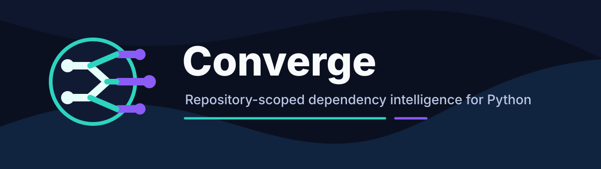

<p align="center">
  
</p>

<p align="center">
  <strong>Repository-scoped dependency intelligence for Python teams.</strong><br>
  Scan manifests and imports, diagnose drift, create environments, and apply validated repairs — without leaving the target repo.
</p>

<p align="center">
  
  
  
  
</p>

<p align="center">
  <a href="#install">Install</a>
  &nbsp;·&nbsp;
  <a href="#quick-start">Quick start</a>
  &nbsp;·&nbsp;
  <a href="#commands">Commands</a>
  &nbsp;·&nbsp;
  <a href="#development">Development</a>
  &nbsp;·&nbsp;
  <a href="docs/CLI.md">CLI reference</a>
  &nbsp;·&nbsp;
  <a href="docs/ROADMAP.md">Roadmap</a>
</p>

---

## Why Converge

Most tools answer one question at a time: what is declared, what is locked, or what is imported. **Converge treats the repository as a system.**

It builds a graph inside the target repo, connects manifests, lockfiles, and source imports, then explains what is missing, unused, or out of sync. Every command is scoped to the path you pass in — running Converge from one directory never writes state into another project.

```text
init ──► check ──► packages ──► fix --apply ──► audit
          │                              │
          ▼                              ▼
   .converge/graph.db            .converge/audit.log
```

---

## Install

Converge ships via a **bash installer** (no PyPI). The script clones the release into `~/.local/share/converge`, installs into a dedicated venv, links `converge` into `~/.local/bin`, and updates your shell `PATH` when needed.

```bash
curl -fsSL https://raw.githubusercontent.com/desenyon/converge/main/install.sh | bash
```

**Pin a release tag:**

```bash
CONVERGE_REF=v0.2.0 curl -fsSL https://raw.githubusercontent.com/desenyon/converge/main/install.sh | bash
```

**Upgrade later:** run the same command again. The installer updates the clone and reinstalls in place.

| Variable | Default | Purpose |
| --- | --- | --- |
| `CONVERGE_HOME` | `~/.local/share/converge` | Clone + venv location |
| `CONVERGE_BIN_DIR` | `~/.local/bin` | Where the `converge` symlink is created |
| `CONVERGE_REPO_URL` | `https://github.com/desenyon/converge.git` | Source repository |
| `CONVERGE_REF` | `main` | Branch or tag to install |

After install, open a new terminal (or `export PATH="$HOME/.local/bin:$PATH"`) and run `converge --help`.

Maintainers: see [docs/RELEASE.md](docs/RELEASE.md) for manual tagging and release steps.

---

## Quick start

```python
# main.py
import requests
```

```toml
# pyproject.toml
[project]
name = "demo"
dependencies = []
```

```bash
converge init /path/to/demo
converge check /path/to/demo
converge packages /path/to/demo
converge fix /path/to/demo
converge fix /path/to/demo --apply
converge audit /path/to/demo
```

---

## Commands

<table>
  <thead>
    <tr>
      <th align="left">Command</th>
      <th align="left">What it does</th>
    </tr>
  </thead>
  <tbody>
    <tr>
      <td><code>init</code></td>
      <td>Scaffold a repository-local <code>.converge.toml</code>.</td>
    </tr>
    <tr>
      <td><code>scan</code></td>
      <td>Parse manifests, lockfiles, imports, workspaces, and optional npm/system/cargo/conda hints into <code>.converge/graph.db</code>.</td>
    </tr>
    <tr>
      <td><code>check</code></td>
      <td>Run <code>scan</code> + <code>doctor</code> in one step (CI-friendly).</td>
    </tr>
    <tr>
      <td><code>doctor</code></td>
      <td>Report unresolved imports, unused deps, version clashes, lockfile/compile drift. JSON includes per-package <code>{declared, locked, imported}</code>.</td>
    </tr>
    <tr>
      <td><code>packages</code></td>
      <td>List declared, imported, missing, and unused packages.</td>
    </tr>
    <tr>
      <td><code>explain</code></td>
      <td>Trace a conflict ID or package node through the graph.</td>
    </tr>
    <tr>
      <td><code>create</code></td>
      <td>Build <code>.venv</code> with <code>uv sync --frozen</code> when locked, else constraint-aware installs (<code>--provider auto</code>).</td>
    </tr>
    <tr>
      <td><code>fix</code></td>
      <td>Ranked repair plans (add / pin / remove). <code>--apply</code> validates in an isolated sandbox before touching the host repo.</td>
    </tr>
    <tr>
      <td><code>toolchain</code></td>
      <td>Detect uv, poetry, pip-tools, or pip and recommend the right install command.</td>
    </tr>
    <tr>
      <td><code>lock</code></td>
      <td>Regenerate <code>uv.lock</code> or run <code>pip-compile</code> for pip-tools repos.</td>
    </tr>
    <tr>
      <td><code>audit</code></td>
      <td>Show the append-only repair log from <code>fix --apply</code>.</td>
    </tr>
    <tr>
      <td><code>status</code></td>
      <td>Dashboard for graph state, scan fingerprints, and lockfiles.</td>
    </tr>
    <tr>
      <td><code>export</code></td>
      <td>Write graph JSON or CSV under <code>.converge/exports/</code>.</td>
    </tr>
    <tr>
      <td><code>clean</code></td>
      <td>Remove Converge artifacts from the target repository.</td>
    </tr>
  </tbody>
</table>

Full flag reference: [docs/CLI.md](docs/CLI.md)

### Recommended workflow

```bash
converge check /path/to/repo
converge packages /path/to/repo
converge doctor /path/to/repo --type unresolved_import
converge fix /path/to/repo --apply
converge status /path/to/repo
```

### Global flags

```bash
converge --version
converge --json doctor /path/to/repo
converge --quiet scan /path/to/repo
converge --verbose fix /path/to/repo
```

`--json` envelopes include `schema_version` and `tool_version` for stable CI parsing.

### Exit codes

| Code | Meaning |
| ---: | --- |
| `0` | Success |
| `1` | Issues found (`doctor`, `fix` dry-run, `packages`) |
| `2` | Command error (missing graph, failed export, etc.) |

---

## Repository-local state

| Path | Role |
| --- | --- |
| `.converge/graph.db` | SQLite dependency graph |
| `.converge/scan_state.json` | Incremental scan fingerprints |
| `.converge/exports/` | JSON / CSV exports |
| `.converge/audit.log` | Append-only repair audit trail |
| `.converge.toml` | Optional repo configuration |
| `.venv` | Default environment from `create` |

```toml
[tool.converge]
incremental_scan = true
skip_type_checking_imports = true
repair_targets = ["pyproject", "requirements"]
extra_scan_roots = ["src"]
```

Run `converge init .` to scaffold a commented `.converge.toml`.

---

## What Converge understands

| Layer | Sources |
| --- | --- |
| **Python manifests** | `pyproject.toml`, `requirements*.txt`, `requirements*.in`, `constraints*.txt` |
| **Lockfiles** | `uv.lock`, `poetry.lock`, pip-tools compile output |
| **Source** | AST imports (incl. `TYPE_CHECKING`, dynamic imports), service routes |
| **Toolchains** | uv workspaces, dependency groups, `[tool.uv.sources]` |
| **Other ecosystems** | `package.json`, `Dockerfile` / `apt.txt`, `Cargo.toml`, `environment.yml` |

Repairs are conservative: `fix --apply` never mutates the host repo unless sandbox validation passes first.

---

## Development

```bash
git clone https://github.com/desenyon/converge.git
cd converge
python3.12 -m venv .venv
source .venv/bin/activate
pip install -e ".[dev]"
```

```bash
TMPDIR=/tmp PYTHONDONTWRITEBYTECODE=1 PYTHONPATH=src .venv/bin/pytest tests/unit tests/integration -v
.venv/bin/ruff check src tests
.venv/bin/mypy src/converge
```

Contributor notes: [AGENTS.md](AGENTS.md) · Architecture: [docs/architecture.md](docs/architecture.md)

---

## License

MIT — see [LICENSE](LICENSE).
