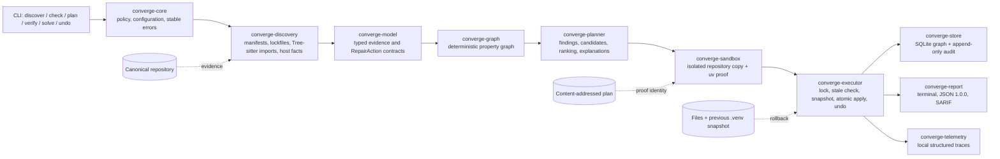
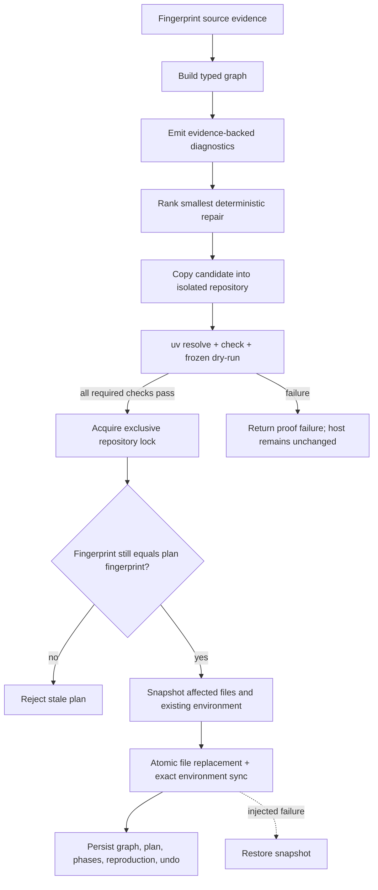

<div align="center">


<br />

**A local-first dependency intelligence engine that turns an unfamiliar Python repository into a verified, reproducible environment.**

[](https://github.com/desenyon/converge/actions/workflows/ci.yml)
[](rust-toolchain.toml)
[](LICENSE)
[](schemas/)
[](SECURITY.md)

[Quick start](#quick-start) · [How it works](#how-it-works) · [Safety model](#safety-is-the-product) · [Architecture](#architecture) · [Docs](#documentation)

</div>

---

Most environment tools begin after you already understand the project. Converge begins before that.

It reads the repository as evidence—manifests, lockfiles, imports, runtimes, tools, and host constraints—then builds a typed dependency model, explains what is inconsistent, proposes the smallest deterministic repair, proves that repair in isolation, and only then touches the host.

```text
unknown repository
       │
       ▼
 discover evidence ──► typed graph ──► diagnostics ──► ranked repair plan
                                                            │
                                                            ▼
                                                isolated uv validation
                                                            │
                                          only if every required check passes
                                                            ▼
                                              atomic apply + audit + undo
```

## Quick start

Preview everything without mutation:

```bash
converge solve . --dry-run
```

Validate and apply the selected plan:

```bash
converge solve . --yes
```

Restore the exact prior files and environment:

```bash
converge undo .
```

Install everything with one command on macOS or Linux:

```bash
curl --proto '=https' --tlsv1.2 -LsSf https://raw.githubusercontent.com/desenyon/converge/codex/converge-rust-rebuild/install.sh | bash
```

The installer checks system build tools, installs missing prerequisites, provisions Rust 1.96 and uv, builds Converge, adds it to your PATH, and verifies the result. Open a new terminal afterward—or run the activation command it prints. Windows and advanced options are covered in the [installation guide](docs/installation.md).

## The one-command contract

`converge solve .` coordinates the entire correctness path:

1. Canonicalize the explicit repository target.
2. Fingerprint relevant source evidence.
3. Parse Python metadata and imports.
4. Build the typed property graph.
5. Emit evidence-backed diagnostics.
6. Generate a content-addressed repair plan.
7. Apply the candidate only inside a temporary repository copy.
8. Ask uv to resolve, check, and dry-run the frozen environment.
9. Recheck the host fingerprint under an exclusive repository lock.
10. Snapshot affected files and any previous `.venv`.
11. Atomically install the exact validated candidate.
12. Persist graph and append-only audit state.
13. Print exact reproduction and undo instructions.

## Safety is the product

| Guarantee | How Converge enforces it |
|---|---|
| Read-only by default | Discovery, graphing, diagnosis, and planning never mutate the target |
| No mutation before proof | Host application is unreachable until isolated validation passes |
| Typed changes only | Every edit is a `RepairAction`, never free-form shell text |
| No shell interpolation | External tools receive individual allowlisted process arguments |
| Deterministic planning | Stable evidence, action ordering, and content-addressed plan IDs |
| Stale-plan rejection | The repository fingerprint is checked again under a lock |
| Atomic application | Cross-platform atomic file replacement prevents partial writes |
| Real rollback | Files and the previous environment remain in a recoverable snapshot |
| Honest uncertainty | Unknown import mappings and incomplete evidence are surfaced |
| Local by default | State, plans, logs, snapshots, graph data, and audit events stay local |
| Machine-readable | Versioned JSON and SARIF 2.1.0 are first-class interfaces |
| Model-independent | No correctness decision depends on an LLM |

Mutation safety is tested by injecting a failure after every transaction phase and proving that host files remain unchanged.

## How it works

### Discover

```bash
converge discover . --json
```

Converge currently extracts PEP 621 metadata, uv lock state, requirements evidence, Python imports through Tree-sitter, host/runtime facts, and stable content fingerprints.

### Diagnose

```bash
converge check .
converge check . --sarif
```

Findings carry stable IDs, severity, affected graph entities, raw evidence locations, confidence, consequences, candidate repair actions, and whether environment creation is blocked.

### Plan

```bash
converge plan . --json
```

Plans include typed actions, dependency ordering, risk, reversibility, network requirements, a file-diff preview, required verification checks, ranking rationale, and rejected alternatives.

### Verify

```bash
converge verify . --json
```

The filesystem-copy backend applies the candidate away from the host, then uses the installed uv binary as the authoritative Python resolver and environment backend.

### Audit and undo

```bash
converge audit . --json
converge undo .
```

SQLite stores a derived graph and append-only audit record under `.converge/`. Original repository files remain canonical.

## Architecture

Converge is one Rust 2024 native binary assembled from narrow, replaceable crates.

| Crate | Responsibility |
|---|---|
| `converge-model` | Stable domain contracts; no filesystem, database, network, CLI, or process code |
| `converge-core` | Use-case policy, configuration precedence, and stable errors |
| `converge-discovery` | Repository, host, manifest, lockfile, and syntax evidence |
| `converge-graph` | Deterministic typed property graph construction |
| `converge-planner` | Diagnostics, repair candidates, ranking, and explanations |
| `converge-sandbox` | Isolated candidate preparation and validation |
| `converge-executor` | Typed tool adapters, atomic transactions, environment sync, and undo |
| `converge-store` | SQLite migrations, graph persistence, and append-only audit |
| `converge-report` | Terminal, JSON, and SARIF output |
| `converge-telemetry` | Local structured traces; export disabled by default |

See the [architecture overview](docs/architecture/overview.md), [data model](docs/architecture/data-model.md), and [repair and sandbox design](docs/architecture/repair-and-sandbox.md).

## Machine interfaces

Every JSON document declares `schemaVersion: "1.0.0"`. Schemas live in [`schemas/`](schemas/) and have compatibility tests.

```bash
converge discover . --json
converge graph . --json
converge diagnose . --json
converge plan . --json
converge verify . --json
converge solve . --dry-run --json
```

SARIF output includes source locations and works with code-scanning systems:

```bash
converge diagnose . --sarif > converge.sarif
```

## Development

```bash
cargo fmt --all -- --check
cargo clippy --workspace --all-targets --all-features -- -D warnings
cargo test --workspace --all-features
cargo audit
cargo deny check
cargo machete
```

The suite covers schema compatibility, configuration precedence, discovery, graph persistence, deterministic diagnostics and plans, real uv validation, offline failure safety, every transaction failure point, full solve, audit, and undo.

## Current scope

The release-proven mutation path is a PEP 621 Python project using uv. Read-only discovery also covers Poetry, Conda environment files, and uv workspaces. Converge deliberately does not claim repair support before an acceptance fixture proves it.

Poetry/Conda repair, local and Git dependency repair, native extensions, container isolation, polyglot plugins, security/SBOM adapters, and MCP transport are tracked transparently in [current limitations](docs/limitations.md) and the [roadmap](docs/ROADMAP.md).

## Documentation

- [CLI reference](docs/commands/cli.md)
- [Installation](docs/installation.md)
- [Threat model](docs/architecture/threat-model.md)
- [JSON and SARIF](docs/formats/json.md)
- [Troubleshooting](docs/troubleshooting.md)
- [Privacy](docs/privacy.md)
- [Security policy](SECURITY.md)
- [Contributing](CONTRIBUTING.md)
- [Current implementation state](docs/CURRENT_STATE.md)

---

<div align="center">

**Converge is part of Concatenate.**

*One repository. One plan. One verified environment.*

</div>

<!-- architecture-atlas-v5:start -->
## Architecture Atlas v5

These editable Mermaid diagrams mirror the [Notion architecture dossier](https://app.notion.com/p/3b467342e8c1810e81a2f074dcc61660?pvs=204).

### 1. System anatomy


```mermaid
flowchart LR
  CLI["CLI: discover / check / plan / verify / solve / undo"] --> CORE["converge-core<br>policy, configuration, stable errors"]
  CORE --> DISC["converge-discovery<br>manifests, lockfiles, Tree-sitter imports, host facts"]
  DISC --> MODEL["converge-model<br>typed evidence and RepairAction contracts"]
  MODEL --> GRAPH["converge-graph<br>deterministic property graph"]
  GRAPH --> PLAN["converge-planner<br>findings, candidates, ranking, explanations"]
  PLAN --> SANDBOX["converge-sandbox<br>isolated repository copy + uv proof"]
  SANDBOX --> EXEC["converge-executor<br>lock, stale check, snapshot, atomic apply, undo"]
  EXEC --> STORE["converge-store<br>SQLite graph + append-only audit"]
  EXEC --> REPORT["converge-report<br>terminal, JSON 1.0.0, SARIF"]
  EXEC --> TRACE["converge-telemetry<br>local structured traces"]
  REPO[("Canonical repository")] -. evidence .-> DISC
  PLANDB[("Content-addressed plan")] -. proof identity .-> SANDBOX
  SNAP[("Files + previous .venv snapshot")] -. rollback .-> EXEC
```

### 2. Transaction wiring


```mermaid
flowchart TB
  E["Fingerprint source evidence"] --> G["Build typed graph"] --> D["Emit evidence-backed diagnostics"] --> P["Rank smallest deterministic repair"]
  P --> C["Copy candidate into isolated repository"] --> UV["uv resolve + check + frozen dry-run"]
  UV -->|all required checks pass| L["Acquire exclusive repository lock"]
  UV -->|failure| STOP["Return proof failure; host remains unchanged"]
  L --> F{"Fingerprint still equals plan fingerprint?"}
  F -->|no| STALE["Reject stale plan"]
  F -->|yes| S["Snapshot affected files and existing environment"] --> A["Atomic file replacement + exact environment sync"] --> AUDIT["Persist graph, plan, phases, reproduction, undo"]
  A -. injected failure .-> R["Restore snapshot"]
```

### 3. Runtime narrative

```mermaid
sequenceDiagram
  actor Dev as Developer
  participant D as Discovery
  participant P as Graph + Planner
  participant V as Sandbox Validator
  participant T as Host Transaction
  participant S as Store + Report
  Dev->>D: converge solve .
  D->>P: typed repository and host evidence
  P->>V: content-addressed RepairAction plan
  V->>V: apply candidate away from host; run uv proof
  alt proof fails
    V-->>Dev: diagnostics and rejected candidate
  else proof succeeds
    V->>T: validated plan ID
    T->>T: lock + stale fingerprint check + snapshot
    T->>T: atomic apply and environment sync
    T->>S: graph, audit event, undo metadata
    S-->>Dev: reproduction and exact undo instructions
  end
```

### 4. Reliability model

```mermaid
stateDiagram-v2
  [*] --> DISCOVERED
  DISCOVERED --> GRAPHED --> DIAGNOSED --> PLANNED --> SANDBOXED --> VERIFIED
  VERIFIED --> LOCKED --> SNAPSHOTTED --> APPLIED --> AUDITED
  PLANNED --> REJECTED: candidate cannot be proven
  LOCKED --> STALE: repository changed
  SNAPSHOTTED --> ROLLED_BACK: phase failure
  AUDITED --> UNDONE: explicit undo
  REJECTED --> [*]
  STALE --> [*]
  ROLLED_BACK --> [*]
  UNDONE --> [*]
```

<!-- architecture-atlas-v5:end -->
