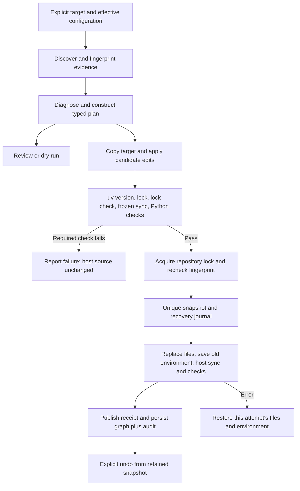

<div align="center">


**Inspect Python dependencies, validate a repair with uv, and apply it with recoverable local state.**

[](https://github.com/desenyon/converge/actions/workflows/ci.yml)
[](LICENSE)
[](schemas/)
</div>

Converge is a local Rust CLI. It reads Python manifests, lockfiles, and imports; produces evidence-backed diagnostics and deterministic repair plans; and uses the installed **uv** executable for resolution, installation, and runtime checks. No account, daemon, or language model is required.

The implemented execution path is deliberately narrow: **one root PEP 621 `pyproject.toml`, with an optional root `uv.lock`**. Poetry, Conda, requirements files, nested projects, and uv workspaces have discovery support. They are not automatically migrated or repaired. This is a developing 0.1 implementation, not a general-purpose repair engine for arbitrary repositories.

- [Setup](#setup)
- [Quick start](#quick-start)
- [Supported behavior](#supported-behavior)
- [Workflow and verification](#workflow-and-verification)
- [Configuration](#configuration)
- [Transactions and recovery](#transactions-and-recovery)
- [Architecture](#architecture)
- [CLI and output](#cli-and-output)
- [Development and tests](#development-and-tests)
- [Migration](#migration)
- [Limitations and troubleshooting](#limitations-and-troubleshooting)

## Setup

You need Rust **1.96 or newer** to build, a native C compiler for bundled SQLite and Tree-sitter, **uv on PATH**, and an installed Python interpreter compatible with the target project. `rust-toolchain.toml` pins 1.96.0 for rustup users. CI pins uv 0.11.28. Converge disables automatic Python downloads during execution; install the required interpreter separately.

Build a reviewed checkout:

```bash
git clone https://github.com/desenyon/converge.git
cd converge
cargo build --release --locked -p converge-cli -j 2
./target/release/converge --version
./target/release/converge doctor
```

The resulting executable is `target/release/converge` (`converge.exe` on Windows). Add that directory to PATH or copy the binary to a directory already on PATH. `doctor` checks uv availability; it does not certify every host requirement or project dependency.

For macOS/Linux, the repository also includes a bootstrap installer:

```bash
# Review install.sh first: it can install prerequisites and update shell startup files.
CONVERGE_SOURCE_DIR="$PWD" bash install.sh
```

Without `CONVERGE_SOURCE_DIR`, the installer downloads this repository's `main` branch. `CONVERGE_REF` selects another branch or tag; `CONVERGE_INSTALL_DIR` changes the destination. Building the local checkout is the way to try an unmerged improvement branch. The PowerShell release installer requires a separately published release asset; this repository does not promise that such an asset exists. See [installation details](docs/installation.md).

## Quick start

Always pass the directory you intend to inspect. It need not be the current directory or a Git root.

```bash
converge discover /path/to/project --json
converge check /path/to/project
converge solve /path/to/project --dry-run --json
```

Review the plan, then validate and apply:

```bash
converge solve /path/to/project --yes
converge audit /path/to/project --json
converge undo /path/to/project
```

With default configuration, `solve` without `--yes` returns the proposed mutation and exit code 1. `--dry-run` stops after planning, returns 0, and creates neither `.venv` nor `.converge`. Setting `autoApply = true` explicitly enables automatic application; read the configuration section before using it in a repository you did not author.

For an offline, dependency-free example with an already installed Python:

```bash
mkdir demo
cat > demo/pyproject.toml <<'TOML'
[project]
name = "converge-demo"
version = "0.1.0"
requires-python = ">=3.11"
dependencies = []
TOML
converge solve demo --yes --offline
converge undo demo
```

Offline projects with dependencies need compatible artifacts already in uv's cache. Converge does not populate that cache in offline mode.

## Supported behavior

| Input or operation | Current implementation |
|---|---|
| Root PEP 621 project | Dependency discovery, planning, isolated validation, apply and undo |
| Missing root `uv.lock` | Explicit `GenerateLockfile` action, even when no dependencies are missing |
| Declared package absent from parsed lock | `RefreshLockfile` action |
| Existing valid lock | `uv lock --check`, then actual `uv sync --frozen` |
| Mapped undeclared imports | Minimal dependency additions, followed by uv resolution |
| Existing host `.venv` | Saved for rollback/undo, replaced by a fresh synchronized environment |
| Poetry, Conda, requirements files | Read-only evidence; no automatic migration |
| Nested projects and uv workspaces | Read-only evidence and project-scoped diagnostics; no root-wide mutation |
| Mixed manifests or discovery warnings | Automatic execution refused |
| Unknown import-to-distribution relationship | No automatic dependency guess |
| Build, test, lint, type, security suites | Not automatically discovered or executed |
| Node, Rust, container and system plugins | Reserved boundaries, not implemented repair backends |
| MCP | Contract scaffold; no CLI transport/server |

The curated mappings are `httpx → httpx`, `rich → rich`, `yaml → pyyaml`, `PIL → pillow`, `cv2 → opencv-python`, `sklearn → scikit-learn`, and `dateutil → python-dateutil`. Static imports do not prove that a dependency is used at runtime. Unused-dependency findings are advisory and never automatically remove packages.

Declarations and imports are compared within the nearest project boundary. A dependency declared by one sibling project cannot satisfy another sibling's import. Requirements files remain distinct evidence rather than being appended to whichever project was discovered first.

## Workflow and verification


```mermaid
flowchart TD
  Input[Explicit target and effective configuration] --> Discover[Discover and fingerprint evidence]
  Discover --> Plan[Diagnose and construct typed plan]
  Plan --> Preview[Review or dry run]
  Plan --> Sandbox[Copy target and apply candidate edits]
  Sandbox --> UV[uv version, lock, lock check, frozen sync, Python checks]
  UV -->|Required check fails| Stop[Report failure; host source unchanged]
  UV -->|Pass| Lock[Acquire repository lock and recheck fingerprint]
  Lock --> Journal[Unique snapshot and recovery journal]
  Journal --> Apply[Replace files, save old environment, host sync and checks]
  Apply --> Commit[Publish receipt and persist graph plus audit]
  Apply -->|Error| Rollback[Restore this attempt's files and environment]
  Commit --> Undo[Explicit undo from retained snapshot]
```

For a supported project, validation runs in a temporary filesystem copy:

1. Recheck the copy's evidence fingerprint against the plan.
2. Apply supported typed manifest edits to the copy.
3. Record `uv --version`.
4. Run `uv lock` if the plan requires generation or refresh.
5. Run `uv lock --check`.
6. Run **`uv sync --frozen`**, installing into the copy's `.venv`.
7. Run `uv run --no-sync python -I -c ...` to confirm a virtual environment and import the curated modules found in source.

An empty required contract fails validation. Required failures stop later checks; advisory failures are retained without failing the whole report. `verify` validates the proposed repair, not only the unmodified source. It never installs the host environment.

On `solve --yes` or authorized `apply`, the exact validated manifest/lock bytes are copied to the host under the transaction lock. A fresh host `.venv` is synchronized with the frozen lock, and the runtime/import checks run again there. Even a project whose dependencies need no repair receives an explicit `CreateEnvironment` action so host installation is not silently skipped.

`--frozen` rejects any proposed lock generation or refresh before validation. It does not bypass a failing lock check. Version/marker drift not diagnosed statically still fails at `uv lock --check`; Converge will not claim that an invalid lock succeeded.

## Configuration

Configuration is resolved for `plan`, `verify`, `solve`, and `apply`, as well as `config explain`. Precedence, highest first:

1. CLI `--offline`, `--timeout SECONDS`, and execution consent `--yes`.
2. `CONVERGE_` environment variables listed below.
3. Target `.converge.toml`.
4. Target `[tool.converge]` in `pyproject.toml`.
5. `~/.config/converge/config.toml` (HOME, or USERPROFILE on Windows).
6. Built-in defaults.

```toml
# .converge.toml — these field names are case-sensitive.
network = "deny"
autoApply = false
commandTimeoutSeconds = 300
telemetry = false
```

| Setting | Default | Environment variable | Behavior |
|---|---|---|---|
| `network` | `"allow"` | `CONVERGE_NETWORK=allow/deny` | `deny` supplies uv's global `--offline` flag for every validation and synchronization command |
| `autoApply` | `false` | `CONVERGE_AUTO_APPLY=true/false` | Authorizes supported execution without `--yes`; planning and dry runs remain read-only |
| `commandTimeoutSeconds` | `300` | `CONVERGE_COMMAND_TIMEOUT_SECONDS` | Positive timeout for each validation command and host synchronization/check |
| `telemetry` | `false` | `CONVERGE_TELEMETRY=true/false` | Reserved export opt-in; no remote telemetry exporter is implemented |

Boolean environment values also accept `1/0` and `yes/no`. Invalid types, unknown TOML settings, unknown network values, and zero/negative timeouts fail with code 2. Tool version discovery uses a separate fixed two-second probe deadline.

```bash
converge config explain /path/to/project --json
converge config explain /path/to/project --offline --timeout 60
converge verify /path/to/project --offline --timeout 60 --json
```

The explanation names the winning source for each field. Execution records that resolved configuration with the audit event. Plan identifiers bind the evidence, actions, network policy, and timeout, so use the same policy when applying a reviewed identifier:

```bash
converge plan /path/to/project --offline --timeout 60 --json
converge apply /path/to/project PLAN_ID_FROM_OUTPUT --yes --offline --timeout 60
```

uv is run without shell interpolation. Converge forces `UV_PROJECT_ENVIRONMENT` to the absolute target/copy `.venv`, removes inherited `VIRTUAL_ENV`, `PYTHONPATH`, and `PYTHONHOME`, and disables Python downloads. Other uv configuration, indexes, cache settings, and credentials remain the installed tool's responsibility. An explicit `UV_CACHE_DIR` is useful in restricted environments.

**Offline is an adapter policy, not an OS firewall.** Package build hooks and imported third-party code execute with the invoking user's privileges. The filesystem-copy backend does not confine their network, filesystem, or process access.

## Transactions and recovery

State lives under the selected repository:

```text
.converge/
  state.lock                     # cooperative exclusive writer lock
  state.db                       # SQLite WAL graph and application audit
  last_applied                   # latest committed attempt identifier
  pending                        # unfinished attempt/recovery, when present
  snapshots/
    attempt-<uuid>/
      metadata.json              # plan identity, files, environment and prior receipt
      files/                     # original affected manifest/lock bytes
      environment/               # previous .venv when one existed
```

The transaction guard holds one lock from host fingerprint checking through file replacement, host environment synchronization, final checks, and audit persistence. Concurrent apply/undo requests fail promptly with a busy error. Validation happens before that lock and the fingerprint is checked again after acquisition.

Each attempt has a unique snapshot independent of the deterministic plan ID. Applying the same plan after undo or a failed attempt does not collide with retained snapshots. The previous successful receipt is preserved when a newer attempt fails.

Affected files are written through atomic sibling-file replacement. This protects individual files from partial writes. Multiple files, `.venv`, and SQLite are **not one filesystem-wide atomic operation**: failures are handled by compensating restoration and the journal. The graph and application audit are committed together in one SQLite transaction.

- Handled mutation failure with successful restoration returns **6**.
- Restoration failure returns **7**, names the failure, and retains the pending journal/snapshot for recovery.
- A pending journal blocks a new application. `converge undo TARGET` recovers that attempt first.
- Otherwise, undo restores the latest successful transaction and its previous receipt. It refuses to overwrite relevant source edits made after that apply.
- Environment backups remain at the same final `.venv` path when restored, preserving their original absolute script paths.

The lock coordinates Converge writers, not editors or unrelated tools. Do not run other environment writers during an apply. There is no power-loss/distributed-commit guarantee across SQLite and the filesystem: abrupt termination can leave a pending journal even if an application audit was already persisted. Audit entries describe observed application work; the journal and undo metadata determine recoverable state. Undo currently restores files/environments without adding a separate audit event or rebuilding the derived graph index.

Old snapshots are retained without automatic garbage collection. They may include an entire previous environment and sensitive values present in original manifests. Add `.converge/` and `.venv/` to your own repository's ignore rules; Converge does not edit `.gitignore`. Keep recovery data until it is no longer needed.

## Architecture

The workspace preserves separate contracts, policy, adapters, and persistence. The CLI currently coordinates the concrete use cases; `converge-core` supplies configuration, errors, and service abstractions.

| Crate | Responsibility |
|---|---|
| `converge-model` | Versioned serializable domain contracts, without I/O |
| `converge-core` | Configuration/provenance and stable error taxonomy |
| `converge-discovery` | Target resolution, manifest/lock parsing, Tree-sitter imports, host tool probes, fingerprints |
| `converge-graph` | Deterministic typed graph from discovery evidence |
| `converge-planner` | Project-scoped diagnostics and deterministic supported uv actions |
| `converge-sandbox` | Temporary-copy preparation, ordered verification, required/advisory semantics |
| `converge-executor` | Bounded uv process adapter, transaction guard, snapshots, environment replacement, undo |
| `converge-store` | rusqlite/bundled SQLite, forward migrations, graph and audit persistence |
| `converge-report` | JSON and SARIF formatting |
| `converge-cli` | Clap interface, orchestration, consent, exit codes and human output |
| `converge-telemetry` | Local tracing initialization |
| `converge-mcp`, `converge-testkit` | Small reserved integration/test scaffolds |

Plans are deterministic rules, not a general constraint solver or measured multiobjective optimizer. uv remains authoritative for package resolution. The domain schema has room for additional actions, but an enum variant's existence does not mean its executor is implemented.

The fingerprint covers recognized Python manifests/locks, Python source, requirements and Conda files, plus `.converge.toml`, `uv.toml`, and `.python-version`. It excludes `.git`, `.converge`, `.venv`, `target`, `node_modules`, and Python bytecode caches. It is not a hash of every asset or native build input in a repository.

## CLI and output

| Command | Meaning |
|---|---|
| `discover [PATH]` | Read repository and host evidence |
| `check [PATH]`, `diagnose [PATH]` | Emit static diagnostics; exit 1 when findings exist |
| `graph [PATH]` | Build a graph from current evidence |
| `explain [PATH]` | Explain diagnostics and their cited evidence |
| `plan [PATH]` | Print the current policy-bound repair plan |
| `verify [PATH]` | Execute that plan in a temporary copy |
| `solve [PATH]` | Preview, or validate and apply with authorization |
| `apply PATH PLAN_ID` | Recompute and require an exact plan ID, then validate and apply |
| `undo [PATH]` | Recover a pending attempt or undo the latest successful one |
| `audit [PATH]` | Read existing local application audit records |
| `config explain [PATH]` | Show effective configuration and provenance |
| `tools`, `doctor` | Probe the installed uv adapter |

`--offline` and `--timeout` are global flags. They affect execution policy, not read-only graph traversal. `--sarif` is supported only on `check` and `diagnose`. `--json` is available on repository commands and configuration explanation; tools/doctor remain human output.

JSON responses include `schemaVersion: "1.0.0"` and a `kind`. The schemas in [`schemas/`](schemas/) and tests define the current contracts. Errors in JSON mode are also JSON on stdout. Subprocess stdout/stderr are captured, not streamed into the JSON channel. Each stream retains at most a 64 KiB prefix plus a truncation marker while the remainder is drained. Basic `TOKEN=`, `PASSWORD=`, and `API_KEY=` line redaction is applied before report persistence; this is not a comprehensive secret scanner.

| Exit | Meaning |
|---|---|
| 0 | Requested operation succeeded, including a planning-only dry run |
| 1 | Static issues found, or mutation awaits authorization |
| 2 | Invalid invocation or configuration |
| 3 | Discovery failure |
| 4 | Selected action conflicts with constraints, such as `--frozen` |
| 5 | Validation, stale plan, unsupported verification, timeout, or busy repository |
| 6 | Mutation failed; rollback completed |
| 7 | Rollback failed; recovery data retained |
| 8 | Required executable unavailable |
| 10 | Storage failure or internal invariant violation |

Code 9 is reserved by the design contract but is not emitted by the current adapter; uv network/cache failures currently appear as validation failures. Static `check` is not an installation or complete parser-health certification; inspect discovery warnings and run verification before trusting an environment.

## Development and tests

Run one compilation job group at a time on a shared machine. Two Cargo jobs are sufficient for local validation:

```bash
cargo fmt --all -- --check
cargo clippy --workspace --all-targets --all-features --locked -j 2 -- -D warnings
cargo test --workspace --all-features --locked -j 2
cargo build --release --locked -p converge-cli -j 2
RUSTDOCFLAGS="-D warnings" cargo doc --workspace --all-features --no-deps --locked -j 2
bash -n install.sh tests/installer.bash
bash tests/installer.bash
```

After fetching the lockfile's dependencies, add `--offline` to Cargo commands to prevent registry access. That flag controls Cargo; Converge's separate `--offline` controls uv. The default test suite includes real uv tests using dependency-free projects and an existing Python interpreter, plus fake-tool policy tests. It does not require PyPI downloads. uv and compatible Python must still be installed.

The public-registry acceptance test is explicitly marked ignored by default. CI runs it separately on Linux, macOS, and Windows:

```bash
cargo test -p converge-cli --test solve_e2e --locked -- --ignored
```

That test repairs missing `httpx` and `rich`, installs into a real environment using an isolated temporary cache, checks imports and audit output, and undoes the repair. It requires network access to public package indexes.

Regression coverage includes missing locks, discovery-only backend refusal, sibling project scoping, configuration precedence and type errors, required verification, bounded output, timeouts, stale fingerprints, unique attempts, lock contention, every exposed file/environment transaction phase, metadata/audit failure, recoverable rollback failure, existing-environment restoration, relative-target scoping, and apply/undo/retry with real offline uv.

The Linux quality job additionally runs pinned `cargo-nextest`, `cargo-audit`, `cargo-deny`, `cargo-machete`, `cargo-llvm-cov` (65% line threshold), and rustdoc with warnings denied. The workflow is the source of truth for hosted checks. No performance benchmarks or cross-platform guarantees are inferred from a local run.

## Migration

This hardening preserves CLI command names and the 1.0.0 public output/configuration schema. Changes users should account for:

- Missing locks now produce an explicit generation action, and supported solves always plan environment synchronization.
- Verification performs a real isolated install and runtime checks. It can now fail where the former dry run or empty contract passed.
- Configuration now controls execution. Previously ignored malformed or misspelled configuration fields fail early.
- Changing network/timeout policy changes a CLI plan ID; regenerate old IDs before applying.
- Requirements files are distinct projects/evidence rather than being merged into the first discovered project.
- Unsupported/mixed/nested layouts remain discoverable but no longer receive unsafe root uv repairs.
- New snapshots use `attempt-<uuid>` directories. Existing plan-named snapshots and `last_applied` pointers remain readable; new metadata fields have defaults. Legacy snapshots lack the new post-apply edit check and prior-receipt chain.
- Embedded Rust callers can keep using file-only `apply_validated` and the legacy separate synchronization helper, but complete workflows should hold `ApplicationTransaction` through synchronization and commit.
- Installer defaults now follow `main`; package metadata and release-installer URLs point at `desenyon/converge`.

No database migration is needed: graph and audit table shapes are unchanged.

## Limitations and troubleshooting

| Symptom | Action |
|---|---|
| No supported verification contract | Target a single independent root PEP 621 project; inspect `discover --json` warnings |
| Offline resolution fails | Provide the required cached artifacts/interpreter, or explicitly allow network after reviewing the project |
| Lock check fails | Inspect uv's recorded diagnostics; unsupported version/marker drift may need an explicit native uv repair |
| Repository busy | Let the active Converge writer finish; locks are released by the OS when the process exits |
| Unfinished transaction | Preserve `.converge/snapshots`, then run `converge undo TARGET` |
| Undo refuses changed source | Save/reconcile later edits first; there is no force-undo flag |
| Cache permission error | Use a writable `UV_CACHE_DIR`; do not delete another process's cache |
| Symlink rejected | Use a regular-file checkout; the copy and transaction backends reject symlink traversal |
| Timeout or truncated output | Adjust `--timeout` if appropriate and use the retained bounded diagnostics; no unbounded raw log is persisted |

The temporary copy is not an OS sandbox. There are no enforced disk quotas, process-count limits, or process-tree termination guarantees. Dependency build hooks and imports may have side effects; use trusted projects or an external container/VM. Source files are never edited as a dependency repair, but original manifests and subprocess messages can contain secrets, so review audit/snapshot data before sharing it.

More detail: [architecture](docs/architecture/overview.md), [transaction design](docs/architecture/repair-and-sandbox.md), [threat model](docs/architecture/threat-model.md), [limitations](docs/limitations.md), [privacy](docs/privacy.md), [current state](docs/CURRENT_STATE.md), [roadmap](docs/ROADMAP.md), [contributing](CONTRIBUTING.md), and [security reporting](SECURITY.md).
